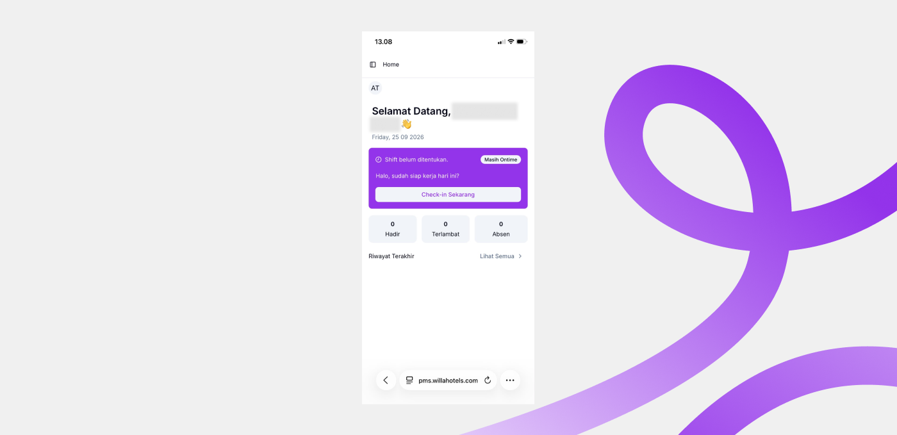
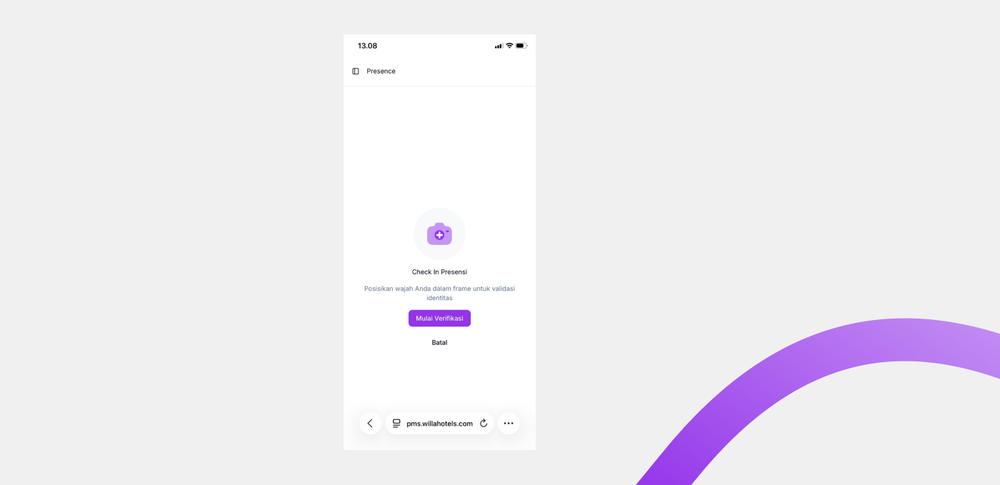
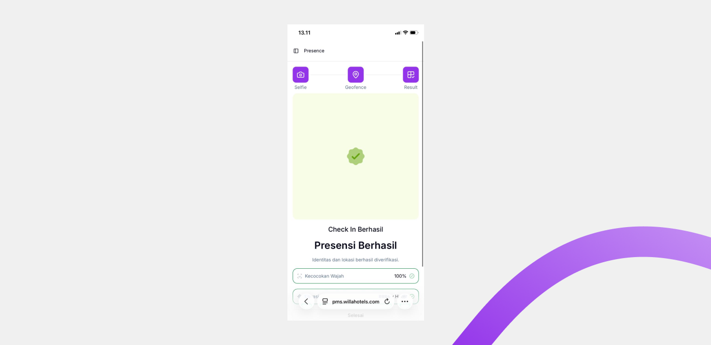

# Presensi

Presensi adalah fitur utama bagi Anda untuk melakukan check-in setiap hari kerja. Halaman ini menampilkan status shift hari ini dan riwayat kehadiran Anda.

## Ringkasan

Check-in presensi dimulai dari tombol pada halaman **Home**. Setelah menekan tombol tersebut, Anda melewati tiga tahap: **Selfie** untuk verifikasi wajah, **Geofence** untuk validasi lokasi, dan **Result** yang menampilkan hasil presensi. Presensi baru tercatat setelah seluruh tahap selesai.

## Siapa yang menggunakan

Semua peran — Employee, HOD, dan HRD — melakukan presensi lewat fitur ini.

## Prasyarat

- Perangkat Anda memiliki kamera dan akses lokasi (GPS) yang aktif.
- Anda berada di dalam area geofence lokasi kerja.
- Wajah Anda sudah terdaftar di sistem oleh HRD. Lihat [Face Registration](../employee-management/face-registration.md).
- Anda sudah memiliki jadwal shift untuk hari tersebut. Lihat [Scheduling](../shift-management/scheduling.md).

## Langkah-langkah

### Buka halaman Home

1. Buka Willa PMS. Halaman **Home** terbuka.

Halaman Home terdiri dari beberapa bagian.

| Bagian | Isi |
| ---------------- | --- |
| Kartu sambutan | Sapaan beserta tanggal hari ini. |
| Kartu shift | Status shift hari ini, misalnya **Tidak ada shift hari ini**, dan tombol **Check-in Sekarang**. |
| Kartu ringkasan | Jumlah **Hadir**, **Terlambat**, dan **Absen** Anda. |
| Riwayat Terakhir | Daftar presensi terakhir, dengan jam **Check In** dan **Check Out** per tanggal. Ketuk **Lihat Semua** untuk melihat riwayat lengkap. |

<small>Jika Anda sudah check-in tetapi belum check-out, tombol pada kartu shift berubah menjadi **Check-out Sekarang**. Panduan check-out dibahas terpisah.</small>

### Mulai check-in

1. Ketuk **Check-in Sekarang** pada kartu shift.
2. Halaman **Check In Presensi** terbuka.

3. Ketuk **Mulai Verifikasi** untuk melanjutkan, atau **Batal** untuk kembali ke halaman Home.

### Berikan izin kamera dan lokasi

Jika izin belum pernah diberikan, dialog **Izin Diperlukan** muncul.

| Izin | Kegunaan |
| ------ | --- |
| Kamera | Untuk verifikasi wajah. |
| Lokasi | Untuk memvalidasi geofence. |

> ℹ️ **Info:** Data kamera dan lokasi hanya dipakai untuk keperluan validasi presensi.

1. Ketuk **Izinkan dan Lanjutkan** untuk memberikan izin, atau **Kembali** untuk membatalkan.

### Ikuti tahap verifikasi

Verifikasi presensi terdiri dari tiga tahap yang ditampilkan pada indikator di bagian atas: **Selfie**, **Geofence**, dan **Result**.

#### Selfie

1. Posisikan wajah Anda dalam area sesuai instruksi di layar. Pastikan pencahayaan cukup dan wajah terlihat jelas.

2. Ketuk **Ambil Foto**.
3. Pratinjau foto tampil. Ketuk **Ambil Lagi** untuk memotret ulang, atau **Lanjutkan** untuk memakai foto tersebut.

Penjelasan lebih lanjut ada di halaman [Face Verification](face-verification.md).

#### Geofence

Setelah foto dikonfirmasi, sistem memvalidasi wajah dan lokasi Anda secara bersamaan.

Penjelasan lebih lanjut ada di halaman [Geofencing](geofencing.md).

#### Result

Layar hasil menampilkan status presensi Anda beserta ringkasan **Kecocokan Wajah** dan **Lokasi**.

Jika presensi berhasil, layar menampilkan status keberhasilan dan presensi Anda tercatat.

Jika presensi gagal, penyebabnya ditampilkan pada layar ini. Ketuk **Ulangi check in** untuk mencoba lagi dari tahap Selfie.

## Hasil

Setelah seluruh tahap verifikasi berhasil, presensi Anda tercatat dan muncul di **Riwayat Terakhir** pada halaman Home.

## Sub-fitur

- [Face Verification](face-verification.md): penjelasan lebih lanjut tentang verifikasi wajah saat presensi.
- [Geofencing](geofencing.md): penjelasan lebih lanjut tentang validasi lokasi saat presensi.

## Lihat juga

- [Fitur](../README.md)
- [Face Registration](../employee-management/face-registration.md)
- [Scheduling](../shift-management/scheduling.md)
- [Peran dan Hak Akses](../../getting-started/peran-dan-hak-akses.md)
