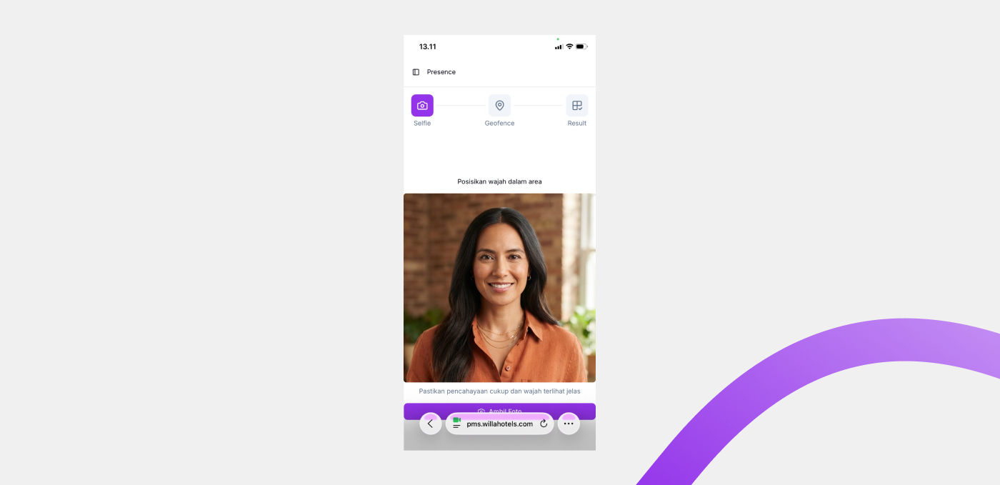
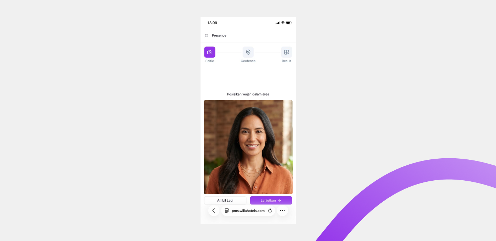
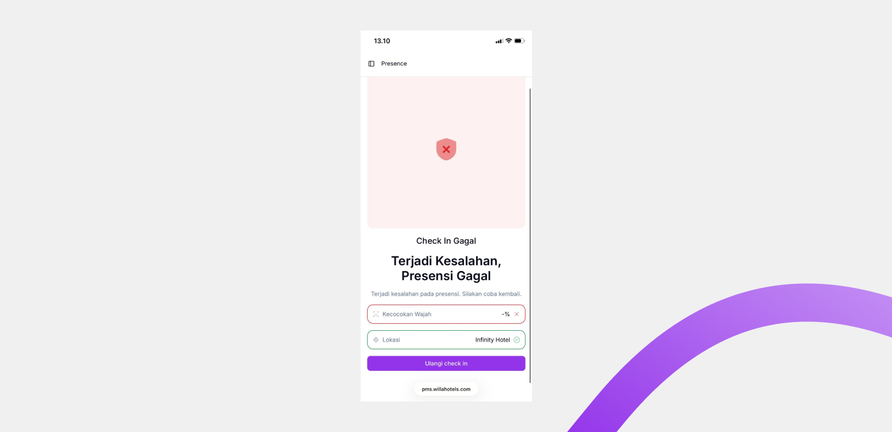

# Face Verification

Face Verification adalah tahap **Selfie** pada alur presensi. Sistem membandingkan foto yang Anda ambil dengan foto wajah yang tersimpan di sistem.

## Ringkasan

Saat tahap Selfie berjalan, kamera aktif dan menampilkan panduan area wajah. Anda memotret wajah, meninjau pratinjau, lalu sistem mencocokkannya dengan data wajah Anda. Jika cocok, Anda lanjut ke validasi lokasi; jika tidak, presensi gagal dan bisa diulang.

## Sebelum memulai

- Wajah Anda sudah terdaftar oleh HRD. Lihat [Face Registration](../employee-management/face-registration.md).
- Anda memberikan izin kamera ketika diminta.
- Anda berada di tempat dengan pencahayaan yang cukup.
- Anda memakai presensi lewat [Presensi](README.md) dan sudah menekan **Mulai Verifikasi**.

## Langkah-langkah

### Posisikan wajah

1. Arahkan wajah ke kamera hingga berada di dalam area panduan.
2. Pastikan hanya satu wajah yang terlihat dan mata terbuka.

### Ambil dan tinjau foto

1. Ketuk **Ambil Foto**.
2. Periksa pratinjau foto.
3. Ketuk **Ambil Lagi** untuk memotret ulang, atau **Lanjutkan** untuk melanjutkan validasi.

### Tunggu hasil pencocokan

Selama validasi, layar menampilkan **Memvalidasi Wajah dan Lokasi**. Hasil pencocokan wajah tampil pada bagian **Kecocokan Wajah** di layar Result.

## Hasil

Jika wajah cocok, tahap ini selesai dan presensi berlanjut ke validasi lokasi. Jika wajah tidak cocok atau tidak terbaca, presensi gagal dan Anda dapat menekan **Ulangi check in**.

## Pesan yang sering muncul

Pesan berikut tampil pada layar Result ketika verifikasi wajah bermasalah.

| Pesan | Arti dan tindakan |
| ----- | ----------------- |
| Tidak Ada Wajah Terdeteksi | Wajah tidak masuk ke area panduan. Dekatkan wajah dan pastikan pencahayaan cukup. |
| Wajah Terdeteksi Lebih Dari Satu | Terdapat lebih dari satu wajah dalam kamera. Pastikan hanya Anda yang terlihat. |
| Mata Tidak Terdeteksi | Mata tidak terbaca. Pastikan wajah terlihat jelas dan tidak tertutup. |
| Mata Tertutup | Mata terdeteksi dalam kondisi tertutup. Buka mata saat memotret. |
| Wajah Tidak Cocok | Wajah tidak sesuai dengan data yang tersimpan. Coba ulangi dengan pencahayaan lebih baik. |
| Validasi Wajah Gagal | Terjadi kesalahan saat validasi. Coba kembali. |
| Layanan Validasi Wajah Bermasalah | Layanan sedang tidak tersedia. Tunggu beberapa saat lalu coba lagi. |

> ⚠️ **Perhatian:** Jika **Wajah Tidak Cocok** terus muncul, laporkan ke HRD untuk memeriksa ulang data wajah Anda. Lihat [Face Registration](../employee-management/face-registration.md).

## Lihat juga

- [Presensi](README.md)
- [Geofencing](geofencing.md)
- [Face Registration](../employee-management/face-registration.md)
