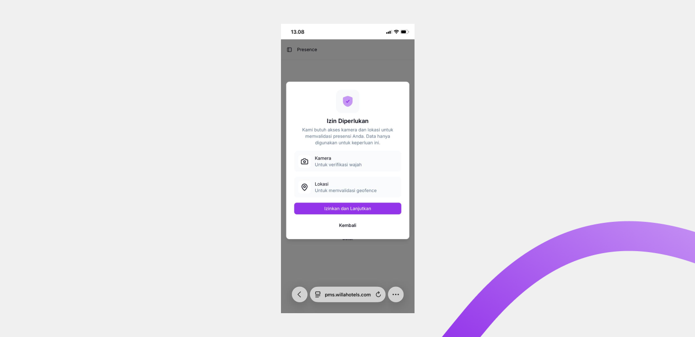
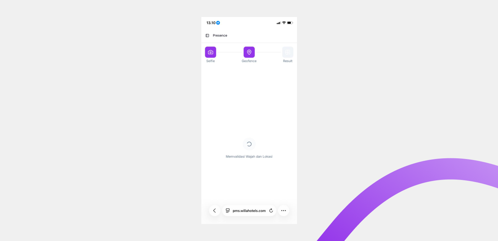

# Geofencing

Geofencing adalah validasi lokasi pada alur presensi. Sistem memeriksa apakah posisi Anda berada di dalam area kantor yang sudah ditentukan sebelum presensi dicatat.

## Ringkasan

Saat tahap Geofence berjalan, sistem membaca titik lokasi perangkat Anda dan membandingkannya dengan area lokasi kerja. Jika Anda berada di dalam area, presensi lanjut dicatat; jika di luar area, presensi gagal. Validasi lokasi berjalan bersamaan dengan validasi wajah.

## Sebelum memulai

- Anda memberikan izin lokasi ketika diminta. Lihat [Presensi](README.md).
- GPS perangkat Anda aktif dan mendapat sinyal.
- Anda berada di dalam area geofence lokasi kerja.

## Langkah-langkah

### Aktifkan izin lokasi

Jika izin belum pernah diberikan, dialog **Izin Diperlukan** muncul.

1. Ketuk **Izinkan dan Lanjutkan** pada dialog agar sistem dapat membaca lokasi Anda, atau **Kembali** untuk membatalkan.

### Tunggu validasi lokasi

Setelah foto dikonfirmasi, layar menampilkan **Memvalidasi Wajah dan Lokasi**. Sistem memproses wajah dan lokasi Anda sekaligus.

### Periksa hasil lokasi

Lokasi kantor yang terbaca tampil pada bagian **Lokasi** di layar Result.

## Hasil

Jika lokasi Anda terbaca di dalam area kantor, validasi lokasi berhasil dan presensi dicatat. Jika di luar area, presensi gagal dan Anda dapat menekan **Ulangi check in**.

## Pesan yang sering muncul

Pesan berikut tampil pada layar Result ketika validasi lokasi bermasalah.

| Pesan | Arti dan tindakan |
| ----- | ----------------- |
| Di Luar Area Kantor | Anda terdeteksi di luar jangkauan area kantor. Dekatkan diri ke lokasi kerja lalu coba lagi. |
| Check-Out Gagal | Kondisi presensi tidak valid untuk check-out. Periksa status presensi Anda hari ini. |

> ℹ️ **Info:** Jika lokasi tetap tidak terbaca, pastikan GPS aktif dan Anda memberi izin lokasi pada browser. Aktifkan mode lokasi presisi bila tersedia.

## Lihat juga

- [Presensi](README.md)
- [Face Verification](face-verification.md)
