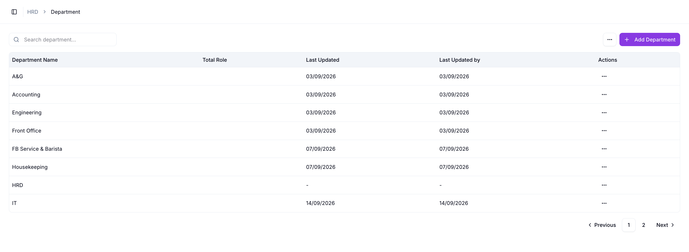
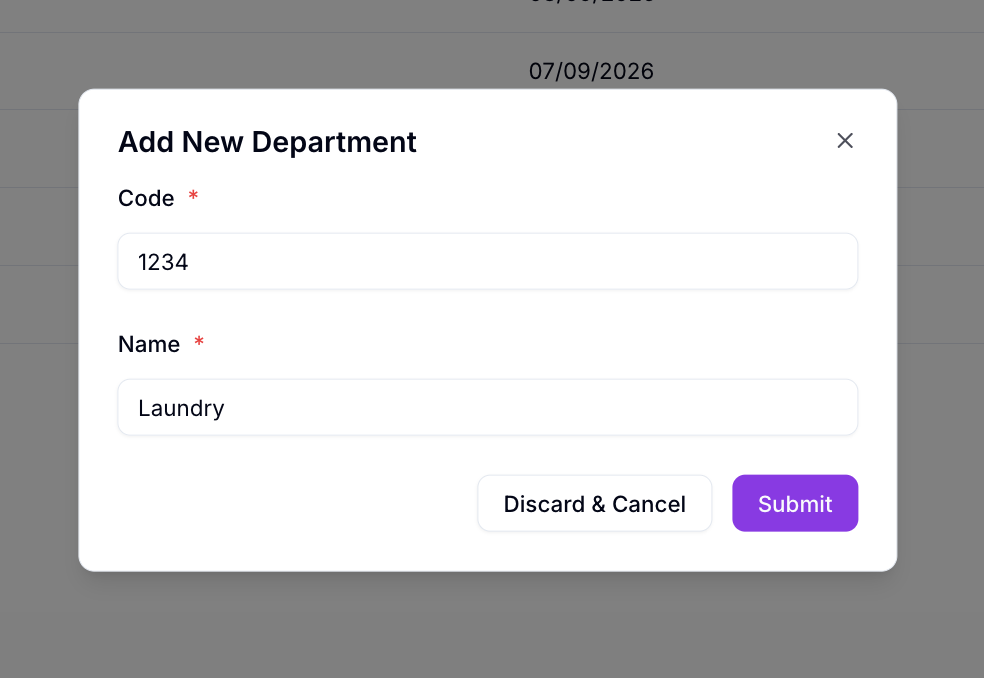
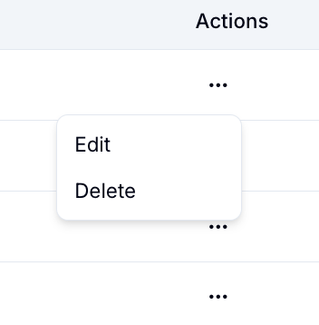

# Management Department

Management Department menampilkan daftar seluruh department di Willa PMS, sekaligus tempat menambah department baru.

## Ringkasan

Di halaman ini Anda bisa mencari department, menambah department baru lewat **Add Department**, serta mengubah atau menghapus department yang sudah ada lewat menu aksi di tiap baris.

## Sebelum memulai

- Anda login sebagai HRD.

## Langkah-langkah

### Buka halaman Department

1. Dari menu navigasi, pilih **Department**.
2. Halaman **Department** terbuka, menampilkan daftar department beserta pencarian dan tombol **+ Add Department** di bagian atas.

### Baca tabel department

Tabel menampilkan kolom berikut.

| Kolom | Isi |
| ---------------- | --- |
| Department Name | Nama department. |
| Total Role | Jumlah role pada department tersebut. |
| Last Updated | Tanggal department terakhir diperbarui. |
| Last Updated by | Nama yang terakhir memperbarui department. |
| Actions | Menu aksi untuk department tersebut. |

Di bawah tabel ada navigasi halaman: **Previous**, nomor halaman, dan **Next**.

### Cari department

1. Ketik nama department pada kolom **Search department...**.

### Tambah department baru

1. Ketuk **+ Add Department**.
2. Dialog **Add New Department** terbuka.

| Field | Wajib | Isi |
| ----- | ----- | --- |
| Code | Ya | Kode department, misalnya `1234`. |
| Name | Ya | Nama department, misalnya `Laundry`. |

1. Isi **Code** dan **Name**.
2. Ketuk **Submit** untuk menyimpan, atau **Discard & Cancel** untuk membatalkan.

### Kelola department yang sudah ada

Setiap baris punya menu aksi (ikon titik tiga) pada kolom **Actions**.

| Aksi | Fungsi |
| ------ | --- |
| Edit | Membuka form yang sama dengan Add Department, terisi data department tersebut, untuk diubah. |
| Delete | Menghapus department tersebut. |

> ⚠️ **Perhatian:** Hapus department hanya jika sudah benar-benar tidak terpakai. Pastikan tidak ada karyawan atau shift type yang masih memakai department tersebut.

## Hasil

Department baru tersimpan dan muncul di daftar, siap dipilih sebagai pilihan **Department** di fitur lain, misalnya saat menambah karyawan atau membuat shift type.

## Lihat juga

- [Department Management](README.md)
- [Employee Management](../employee-management/README.md)
- [Shift Management](../shift-management/README.md)
