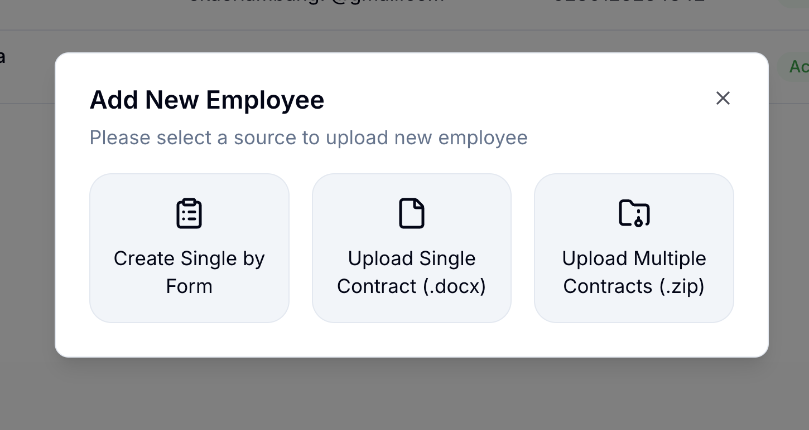
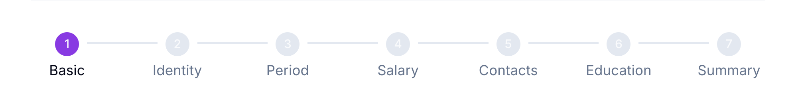

# Add Employee

Add Employee dipakai untuk menambahkan karyawan baru ke Willa PMS, dimulai dari tombol **+ Add Employee** di halaman Employee List.

## Ringkasan

Setelah menekan tombol **+ Add Employee**, muncul dialog untuk memilih sumber data karyawan baru. Halaman ini fokus menjelaskan alur **Create Single by Form**, yaitu mengisi data karyawan secara manual lewat form bertahap.

## Sebelum memulai

- Anda sudah berada di halaman [Employee List](employee-list.md) dan login sebagai HRD.

## Langkah-langkah

### Buka dialog Add New Employee

1. Dari halaman Employee List, ketuk tombol **+ Add Employee**.
2. Dialog **Add New Employee** terbuka, menampilkan tiga pilihan sumber data.

### Pilih sumber data

Dialog menyediakan tiga cara menambahkan karyawan.

- **Create Single by Form**: menambahkan satu karyawan dengan mengisi form secara manual, langkah demi langkah.
- **Upload Single Contract (.docx)**: menambahkan satu karyawan dengan mengunggah satu dokumen kontrak.
- **Upload Multiple Contracts (.zip)**: menambahkan banyak karyawan sekaligus dengan mengunggah kumpulan dokumen kontrak dalam satu file `.zip`.

<small>Dokumentasi ini fokus ke Create Single by Form. Detail alur Upload Single Contract dan Upload Multiple Contracts akan ditambahkan di pembaruan berikutnya.</small>

### Isi form bertahap (Create Single by Form)

Setelah memilih **Create Single by Form**, Anda mengisi data karyawan melalui tujuh tahap berurutan.

| Tahap | Nama |
| ----- | -------- |
| 1 | Basic |
| 2 | Identity |
| 3 | Period |
| 4 | Salary |
| 5 | Contacts |
| 6 | Education |
| 7 | Summary |

<small>Detail field yang perlu diisi di setiap tahap akan dijelaskan di pembaruan berikutnya.</small>

## Hasil

Setelah melengkapi ketujuh tahap, karyawan baru tersimpan dan muncul di [Employee List](employee-list.md).

## Lihat juga

- [Employee Management](README.md)
- [Employee List](employee-list.md)
