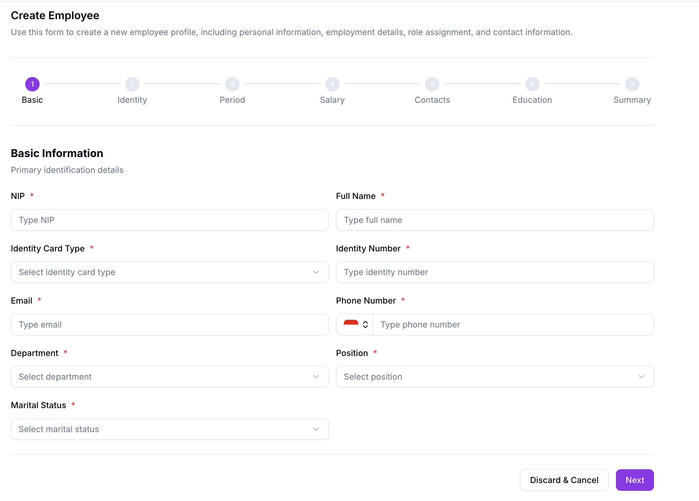
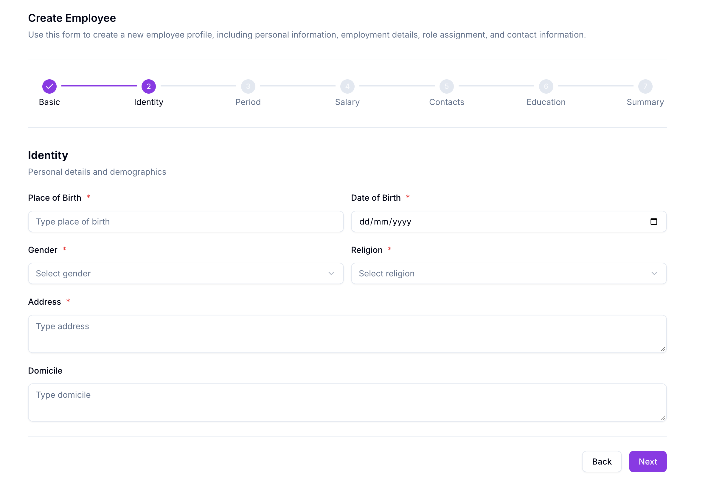
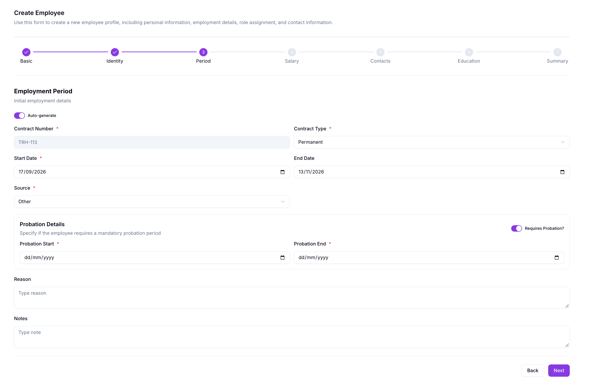

# Add Employee

Add Employee dipakai untuk menambahkan karyawan baru ke Willa PMS, dimulai dari tombol **+ Add Employee** di halaman Employee List.

## Ringkasan

Setelah menekan tombol **+ Add Employee**, muncul dialog untuk memilih sumber data karyawan baru. Halaman ini fokus menjelaskan alur **Create Single by Form**, yaitu mengisi data karyawan secara manual lewat form bertahap.

## Sebelum memulai

- Anda sudah berada di halaman [Employee List](employee-list.md) dan login sebagai HRD.

## Langkah-langkah

### Buka dialog Add New Employee

1. Dari halaman Employee List, ketuk tombol **+ Add Employee**.
2. Dialog **Add New Employee** terbuka, menampilkan tiga pilihan sumber data.

### Pilih sumber data

Dialog menyediakan tiga cara menambahkan karyawan.

- **Create Single by Form**: menambahkan satu karyawan dengan mengisi form secara manual, langkah demi langkah.
- **Upload Single Contract (.docx)**: menambahkan satu karyawan dengan mengunggah satu dokumen kontrak.
- **Upload Multiple Contracts (.zip)**: menambahkan banyak karyawan sekaligus dengan mengunggah kumpulan dokumen kontrak dalam satu file `.zip`.

<small>Dokumentasi ini fokus ke Create Single by Form. Detail alur Upload Single Contract dan Upload Multiple Contracts akan ditambahkan di pembaruan berikutnya.</small>

### Isi form bertahap (Create Single by Form)

Setelah memilih **Create Single by Form**, form **Create Employee** terbuka dan Anda mengisi data karyawan melalui tujuh tahap berurutan.

| Tahap | Nama |
| ----- | -------- |
| 1 | Basic |
| 2 | Identity |
| 3 | Period |
| 4 | Salary |
| 5 | Contacts |
| 6 | Education |
| 7 | Summary |

Tahap yang sudah selesai ditandai centang pada stepper. Ketuk **Next** untuk lanjut ke tahap berikutnya, dan **Back** untuk kembali ke tahap sebelumnya.

> ℹ️ **Info:** Field yang diberi tanda bintang merah (`*`) wajib diisi. Field tanpa tanda tersebut bersifat opsional.

### Tahap 1: Basic

Tahap **Basic** berisi data identitas utama karyawan.

| Field | Wajib | Isi |
| ----- | ----- | --- |
| NIP | Ya | Nomor Induk Pegawai karyawan. |
| Full Name | Ya | Nama lengkap karyawan. |
| Identity Card Type | Ya | Jenis kartu identitas, dipilih dari daftar. |
| Identity Number | Ya | Nomor kartu identitas karyawan. |
| Email | Ya | Alamat email karyawan yang dipakai untuk login. |
| Phone Number | Ya | Nomor telepon karyawan. Kode negara dipilih lewat selector bendera di sisi kiri field. |
| Department | Ya | Department tempat karyawan bekerja, dipilih dari daftar. |
| Position | Ya | Jabatan karyawan, dipilih dari daftar. |
| Marital Status | Ya | Status pernikahan karyawan, dipilih dari daftar. |

1. Isi semua field pada tahap **Basic**.
2. Ketuk **Next**.

Anda masuk ke tahap **Identity**.

> ⚠️ **Perhatian:** Tombol **Discard & Cancel** membatalkan pembuatan karyawan dan membuang data yang sudah Anda isi.

### Tahap 2: Identity

Tahap **Identity** berisi data pribadi dan demografis karyawan.

| Field | Wajib | Isi |
| ----- | ----- | --- |
| Place of Birth | Ya | Tempat lahir karyawan. |
| Date of Birth | Ya | Tanggal lahir karyawan, dengan format `dd/mm/yyyy`. |
| Gender | Ya | Jenis kelamin karyawan, dipilih dari daftar. |
| Religion | Ya | Agama karyawan, dipilih dari daftar. |
| Address | Ya | Alamat karyawan. |
| Domicile | Tidak | Alamat domisili karyawan. |

1. Isi semua field wajib pada tahap **Identity**.
2. Isi **Domicile** jika diperlukan.
3. Ketuk **Next**.

Anda masuk ke tahap **Period**.

### Tahap 3: Period

Tahap **Period** berisi informasi awal masa kerja karyawan, termasuk kontrak dan masa percobaan.

| Field | Wajib | Isi |
| ----- | ----- | --- |
| Auto-generate | Tidak | Sakelar untuk membuat nomor kontrak secara otomatis. |
| Contract Number | Ya | Nomor kontrak karyawan. Terisi otomatis dan tidak bisa diketik selama **Auto-generate** aktif. |
| Contract Type | Ya | Jenis kontrak, dipilih dari daftar, misalnya `Permanent`. |
| Start Date | Ya | Tanggal kontrak mulai berlaku. |
| End Date | Tidak | Tanggal kontrak berakhir. |
| Source | Ya | Sumber karyawan, dipilih dari daftar, misalnya `Other`. |
| Requires Probation? | Tidak | Sakelar untuk menandai karyawan memerlukan masa percobaan. |
| Probation Start | Ya, jika probation aktif | Tanggal masa percobaan dimulai. |
| Probation End | Ya, jika probation aktif | Tanggal masa percobaan berakhir. |
| Reason | Tidak | Alasan, ditulis dengan teks bebas. |
| Notes | Tidak | Catatan tambahan, ditulis dengan teks bebas. |

1. Biarkan **Auto-generate** aktif agar nomor kontrak terisi otomatis, atau nonaktifkan untuk mengisinya sendiri.
2. Pilih **Contract Type**.
3. Isi **Start Date**, dan **End Date** jika diperlukan.
4. Pilih **Source**.
5. Pada bagian **Probation Details**, aktifkan **Requires Probation?** jika karyawan memerlukan masa percobaan.
6. Isi **Probation Start** dan **Probation End**.
7. Isi **Reason** dan **Notes** jika diperlukan.
8. Ketuk **Next**.

Anda masuk ke tahap **Salary**.

<small>Detail tahap 4 sampai 7 (Salary, Contacts, Education, dan Summary) akan ditambahkan di pembaruan berikutnya.</small>

## Hasil

Setelah melengkapi ketujuh tahap, karyawan baru tersimpan dan muncul di [Employee List](employee-list.md).

## Lihat juga

- [Employee Management](README.md)
- [Employee List](employee-list.md)
