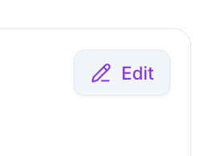
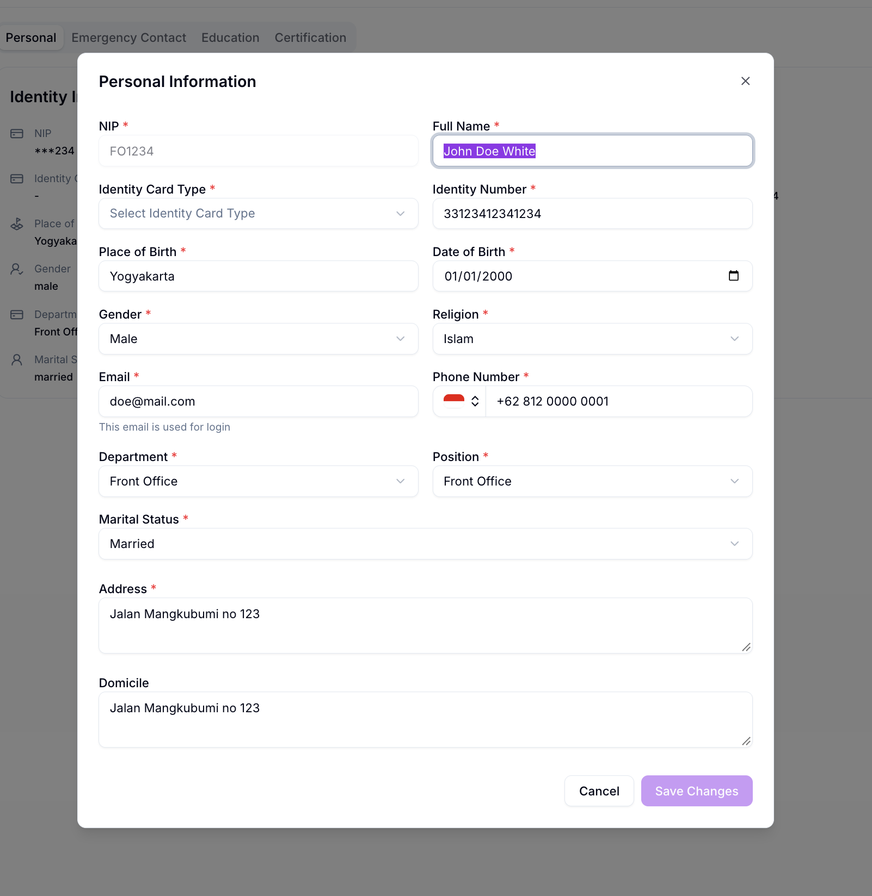
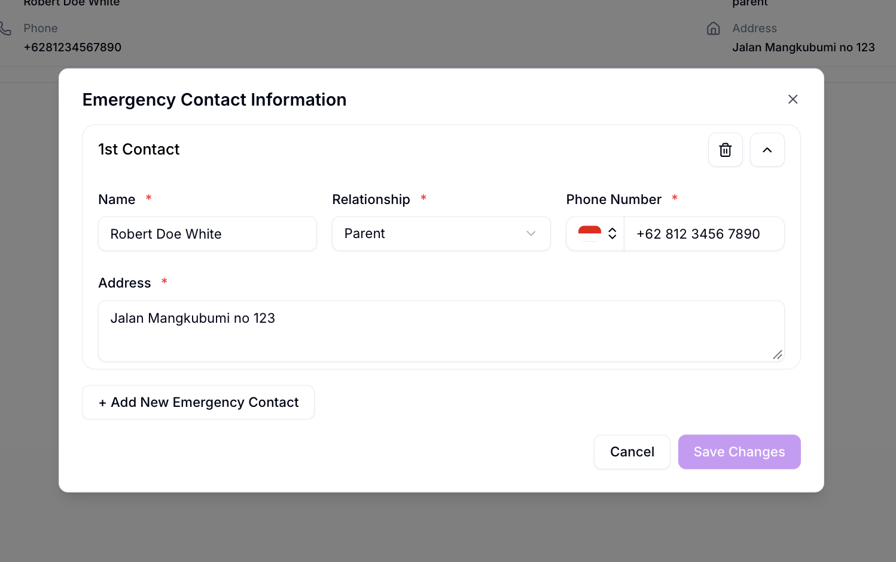
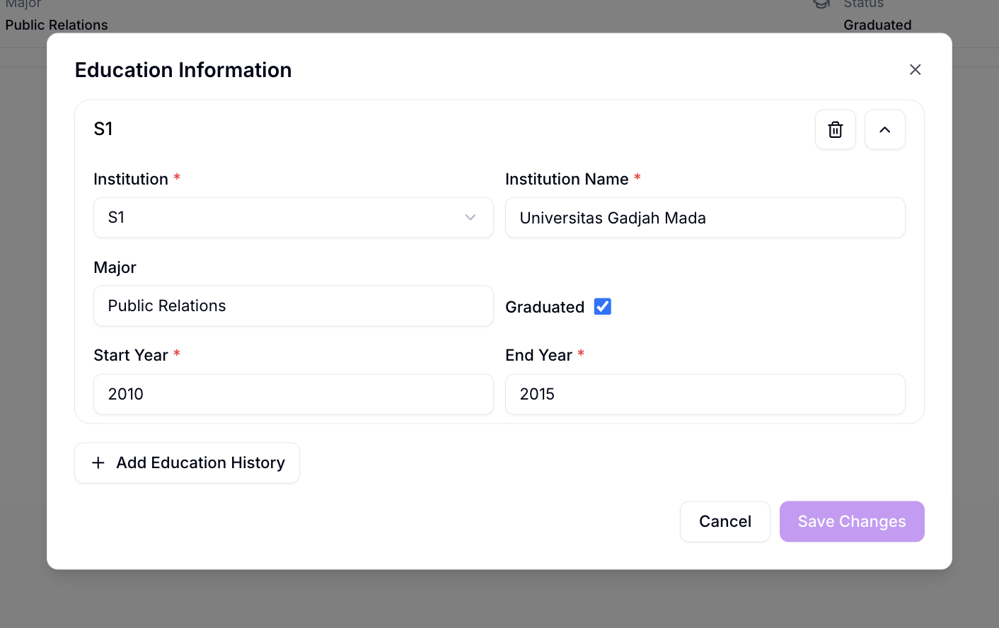
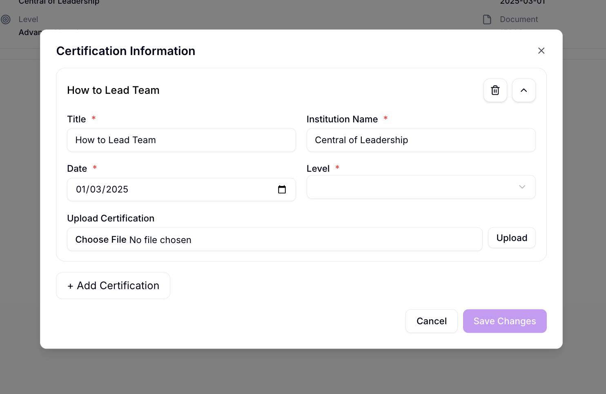

# Edit Employee

Edit Employee dipakai untuk mengubah data karyawan yang sudah terdaftar, dilakukan dari halaman Employee Detail.

## Ringkasan

Anda mengubah data karyawan per tab, sesuai kategori data yang ingin diubah: **Personal**, **Emergency Contact**, **Education**, atau **Certification**. Setiap tab punya tombol **Edit** sendiri yang membuka modal berisi form data tab tersebut.

## Sebelum memulai

- Anda sudah berada di halaman [Employee Detail](employee-detail.md), pada tab yang datanya ingin Anda ubah.

## Langkah-langkah

### Buka modal edit

1. Pada halaman Employee Detail, pilih tab yang ingin diubah: **Personal**, **Emergency Contact**, **Education**, atau **Certification**.
2. Ketuk tombol **Edit** di pojok kanan atas kartu.

Modal edit untuk tab terkait terbuka.

### Edit Personal Information

Modal **Personal Information** berisi seluruh data identitas dan kontak karyawan.

| Field | Wajib | Isi |
| ------------------- | ----- | --- |
| NIP | Ya | Nomor Induk Pegawai karyawan. |
| Full Name | Ya | Nama lengkap karyawan. |
| Identity Card Type | Ya | Jenis kartu identitas, dipilih dari daftar. |
| Identity Number | Ya | Nomor kartu identitas karyawan. |
| Place of Birth | Ya | Tempat lahir karyawan. |
| Date of Birth | Ya | Tanggal lahir karyawan. |
| Gender | Ya | Jenis kelamin karyawan, dipilih dari daftar. |
| Religion | Ya | Agama karyawan, dipilih dari daftar. |
| Email | Ya | Alamat email karyawan. |
| Phone Number | Ya | Nomor telepon karyawan. |
| Department | Ya | Department tempat karyawan bekerja, dipilih dari daftar. |
| Position | Ya | Jabatan karyawan, dipilih dari daftar. |
| Marital Status | Ya | Status pernikahan karyawan, dipilih dari daftar. |
| Address | Ya | Alamat karyawan. |
| Domicile | Tidak | Alamat domisili karyawan. |

> ℹ️ **Info:** Field **Email** diberi keterangan "This email is used for login", karena email ini juga dipakai untuk login ke Willa PMS.

1. Ubah field yang diperlukan.
2. Ketuk **Save Changes** untuk menyimpan, atau **Cancel** untuk membatalkan.

### Edit Emergency Contact Information

Modal **Emergency Contact Information** menampilkan satu kartu untuk setiap kontak darurat yang sudah ditambahkan.

| Field | Wajib | Isi |
| ------------ | ----- | --- |
| Name | Ya | Nama kontak darurat. |
| Relationship | Ya | Hubungan kontak dengan karyawan, dipilih dari daftar. |
| Phone Number | Ya | Nomor telepon kontak darurat. |
| Address | Ya | Alamat kontak darurat. |

1. Ubah data pada kartu kontak yang diperlukan.
2. Ketuk ikon tempat sampah di pojok kanan atas kartu untuk menghapus kontak tersebut, atau ikon panah untuk melipat (collapse) kartu.
3. Ketuk **+ Add New Emergency Contact** jika ingin menambah kontak darurat lain.
4. Ketuk **Save Changes** atau **Cancel**.

### Edit Education Information

Modal **Education Information** menampilkan satu kartu untuk setiap riwayat pendidikan yang sudah ditambahkan.

| Field | Wajib | Isi |
| ----------------- | ----- | --- |
| Institution | Ya | Jenjang pendidikan, dipilih dari daftar, misalnya `S1`. |
| Institution Name | Ya | Nama institusi pendidikan. |
| Major | Tidak | Jurusan atau bidang studi. |
| Graduated | Tidak | Kotak centang untuk menandai apakah karyawan sudah lulus dari jenjang ini. |
| Start Year | Ya | Tahun mulai pendidikan. |
| End Year | Ya | Tahun selesai pendidikan. |

1. Ubah data pada kartu pendidikan yang diperlukan.
2. Ketuk ikon tempat sampah di pojok kanan atas kartu untuk menghapus riwayat tersebut, atau ikon panah untuk melipat (collapse) kartu.
3. Ketuk **+ Add Education History** jika ingin menambah riwayat pendidikan lain.
4. Ketuk **Save Changes** atau **Cancel**.

### Edit Certification Information

Modal **Certification Information** menampilkan satu kartu untuk setiap sertifikat yang sudah ditambahkan.

| Field | Wajib | Isi |
| -------------------- | ----- | --- |
| Title | Ya | Nama sertifikat. |
| Institution Name | Ya | Nama institusi penerbit sertifikat. |
| Date | Ya | Tanggal sertifikat diterbitkan. |
| Level | Ya | Tingkat sertifikasi, dipilih dari daftar. |
| Upload Certification | Tidak | Unggah file sertifikat, lalu ketuk tombol **Upload**. |

1. Ubah data pada kartu sertifikat yang diperlukan.
2. Ketuk ikon tempat sampah di pojok kanan atas kartu untuk menghapus sertifikat tersebut, atau ikon panah untuk melipat (collapse) kartu.
3. Ketuk **+ Add Certification** jika ingin menambah sertifikat lain.
4. Ketuk **Save Changes** atau **Cancel**.

## Hasil

Setelah menekan **Save Changes**, data pada tab terkait diperbarui dan langsung terlihat di halaman [Employee Detail](employee-detail.md).

## Lihat juga

- [Employee Management](README.md)
- [Employee Detail](employee-detail.md)
- [Add Employee](add-employee.md)
