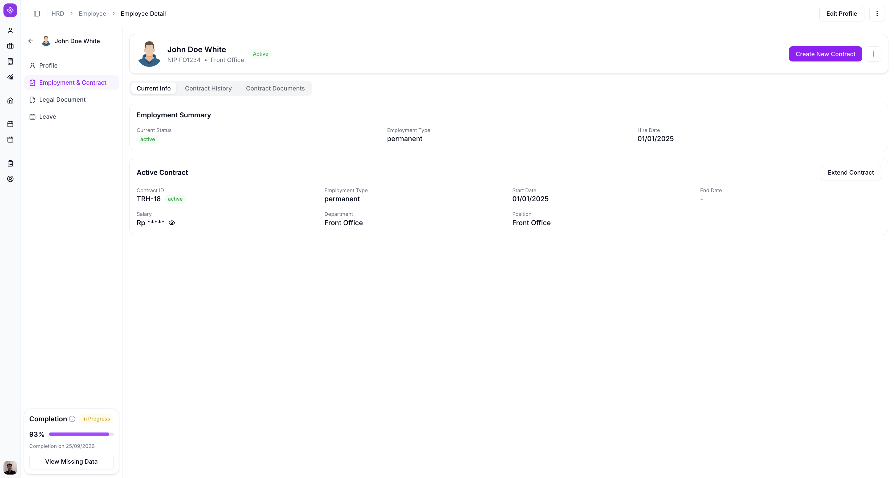
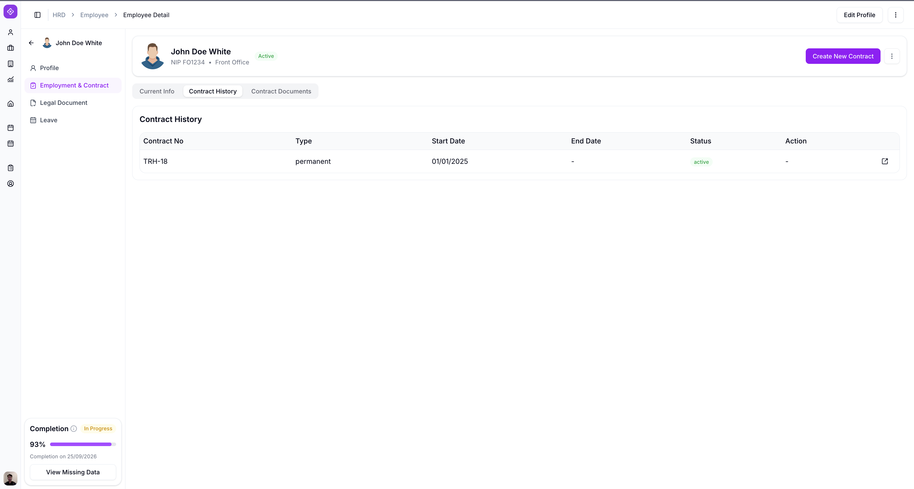
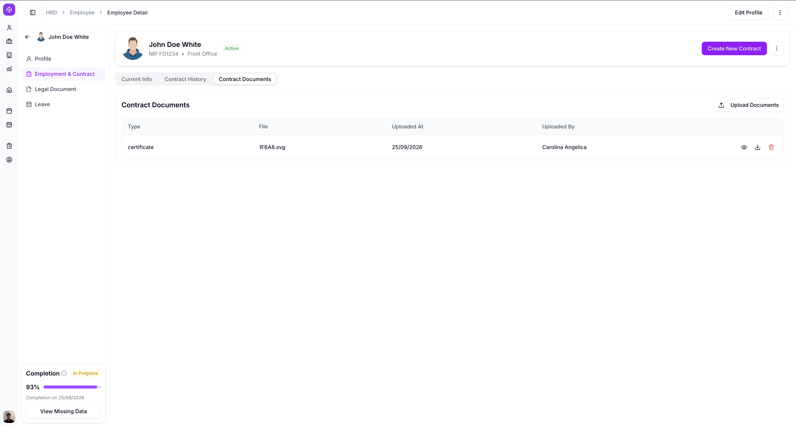
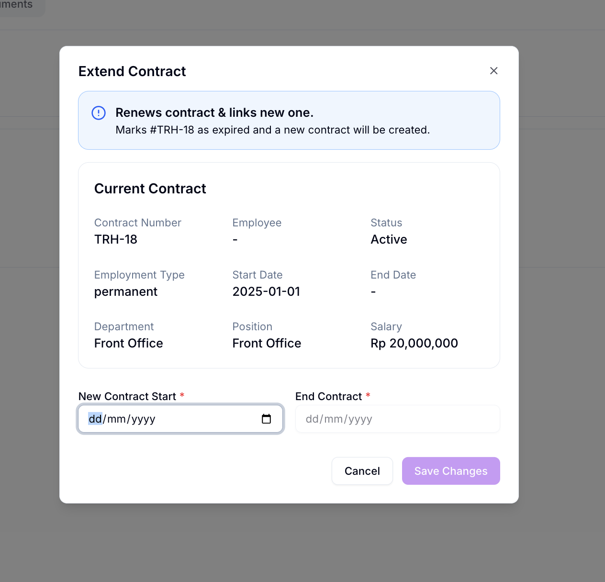

# Employee Detail

Employee Detail menampilkan seluruh informasi lengkap satu karyawan, diakses dari halaman Employee List.

## Ringkasan

Halaman ini terdiri dari navigasi sisi kiri (Profile, Employment & Contract, Legal Document, Leave) dan, di dalam **Profile**, empat tab konten: Personal, Emergency Contact, Education, dan Certification.

## Sebelum memulai

- Anda sudah login sebagai HRD dan berada di halaman [Employee List](employee-list.md).

## Langkah-langkah

### Buka Employee Detail

1. Pada halaman Employee List, ketuk menu titik tiga (**...**) di baris karyawan yang dituju.
2. Pilih **Detail**.

Halaman **Employee Detail** terbuka.

### Navigasi sisi kiri

Halaman Employee Detail punya navigasi sisi kiri dengan empat menu.

| Menu | Keterangan |
| --------------------- | --- |
| Profile | Menampilkan seluruh data personal karyawan, terbagi dalam 4 tab. |
| Employment & Contract | Menampilkan data kepegawaian dan kontrak karyawan. |
| Legal Document | Masih dalam pengembangan. |
| Leave | Masih dalam pengembangan. |

<small>Dokumentasi Legal Document dan Leave akan ditambahkan setelah fitur tersebut tersedia.</small>

### Kartu info umum

Di atas keempat tab, ada kartu berisi info umum karyawan: foto profil, nama, NIP, dan status (misalnya `Active`), diikuti bagian **Contact Details** (Email, Phone, Address, Domicile) serta **Completion** yang menunjukkan persentase kelengkapan data dan tombol **View Missing Data**.

Jika karyawan belum melakukan registrasi wajah, tag **Face Not Registered** dan tombol **Register Face** muncul di bawah foto profil.

Setelah registrasi wajah selesai, tag dan tombol tersebut hilang dari kartu.

<small>Lihat [Face Registration](face-registration.md) untuk cara mendaftarkan wajah karyawan.</small>

### Tab Personal

Tab **Personal** menampilkan **Identity Info** karyawan: NIP, Identity Card Type, Place of Birth, Gender, Department, Marital Status, Full Name, Identity Number, Date of Birth, Religion, dan Position.

1. Ketuk tombol **Edit** di pojok kanan atas untuk mengubah data pada tab ini.

### Tab Emergency Contact

Tab **Emergency Contact** menampilkan kontak darurat karyawan: Name, Relationship, Phone, dan Address.

1. Ketuk tombol **Edit** di pojok kanan atas untuk mengubah data pada tab ini.

### Tab Education

Tab **Education** menampilkan riwayat pendidikan karyawan: jenjang (misalnya `S1`), Institution, Major, Year, dan Status.

1. Ketuk tombol **Edit** di pojok kanan atas untuk mengubah data pada tab ini.

### Tab Certification

Tab **Certification** menampilkan riwayat sertifikat karyawan: nama sertifikat, Institution, Level, Date, dan Document.

1. Ketuk tombol **Edit** di pojok kanan atas untuk mengubah data pada tab ini.
2. Ketuk ikon mata di samping **Document** untuk melihat file sertifikat yang diunggah.

### Employment & Contract

Menu **Employment & Contract** menampilkan data kepegawaian dan kontrak karyawan, dengan tiga tab: **Current Info**, **Contract History**, dan **Contract Documents**. Di pojok kanan atas ada tombol **Create New Contract** dan menu titik tiga.

#### Tab Current Info

Tab **Current Info** menampilkan dua kartu: **Employment Summary** dan **Active Contract**.

| Kartu | Field | Isi |
| ------------------ | --------------- | --- |
| Employment Summary | Current Status | Status kepegawaian karyawan saat ini, misalnya `active`. |
| Employment Summary | Employment Type | Jenis hubungan kerja, misalnya `permanent`. |
| Employment Summary | Hire Date | Tanggal karyawan mulai bekerja. |
| Active Contract | Contract ID | Nomor kontrak aktif, disertai status. |
| Active Contract | Employment Type | Jenis kontrak. |
| Active Contract | Start Date | Tanggal kontrak mulai berlaku. |
| Active Contract | End Date | Tanggal kontrak berakhir. |
| Active Contract | Salary | Gaji pada kontrak ini, disamarkan secara default. |
| Active Contract | Department | Department karyawan pada kontrak ini. |
| Active Contract | Position | Jabatan karyawan pada kontrak ini. |

1. Ketuk ikon mata di samping **Salary** untuk menampilkan nominal gaji.
2. Ketuk **Extend Contract** untuk memperpanjang kontrak aktif.

#### Tab Contract History

Tab **Contract History** menampilkan riwayat seluruh kontrak karyawan dalam bentuk tabel: Contract No, Type, Start Date, End Date, Status, dan Action.

1. Ketuk ikon pada kolom **Action** untuk membuka detail kontrak tersebut.

#### Tab Contract Documents

Tab **Contract Documents** menampilkan dokumen kontrak yang sudah diunggah, dalam bentuk tabel: Type, File, Uploaded At, dan Uploaded By.

1. Ketuk **Upload Documents** untuk mengunggah dokumen baru.
2. Ketuk ikon mata, unduh, atau tempat sampah di ujung kanan baris untuk melihat, mengunduh, atau menghapus dokumen tersebut.

#### Extend Contract

Ketuk tombol **Extend Contract** pada tab **Current Info** untuk membuka modal ini.

> ℹ️ **Info:** Memperpanjang kontrak akan menandai kontrak yang sedang aktif sebagai expired, dan membuat kontrak baru yang terhubung dengannya.

Modal ini menampilkan ringkasan **Current Contract** (Contract Number, Employee, Status, Employment Type, Start Date, End Date, Department, Position, Salary) yang tidak bisa diubah, diikuti dua field berikut.

| Field | Wajib | Isi |
| ------------------ | ----- | --- |
| New Contract Start | Ya | Tanggal mulai kontrak baru. |
| End Contract | Ya | Tanggal berakhir kontrak baru. |

1. Isi **New Contract Start** dan **End Contract**.
2. Ketuk **Save Changes** untuk membuat kontrak baru, atau **Cancel** untuk membatalkan.

## Hasil

Anda bisa melihat seluruh data personal, kontak darurat, pendidikan, sertifikasi, serta data kepegawaian dan kontrak karyawan dari satu halaman, memantau kelengkapan datanya lewat indikator **Completion**, dan memperpanjang kontrak yang sedang aktif lewat **Extend Contract**.

## Lihat juga

- [Employee Management](README.md)
- [Employee List](employee-list.md)
- [Face Registration](face-registration.md)
- [Edit Employee](edit-employee.md)
