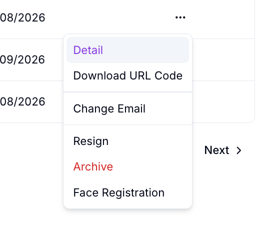
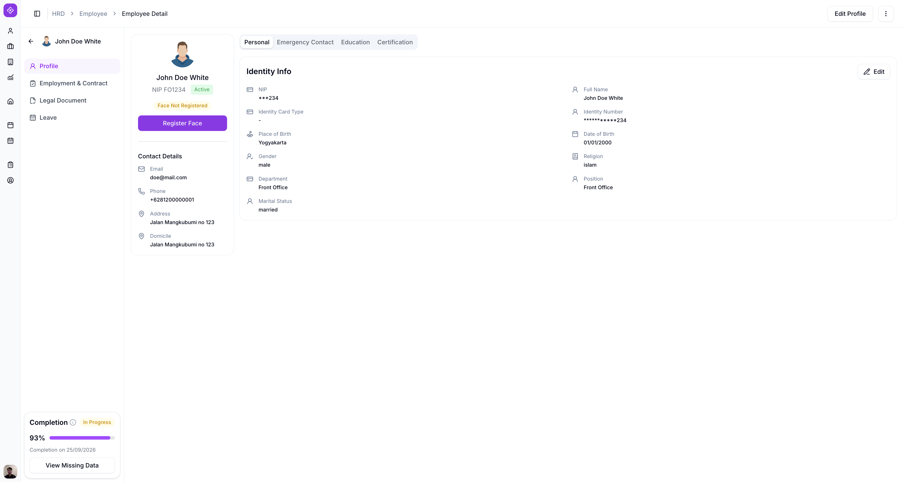
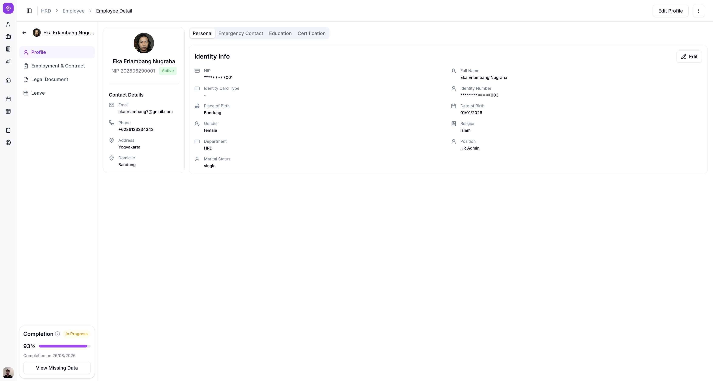
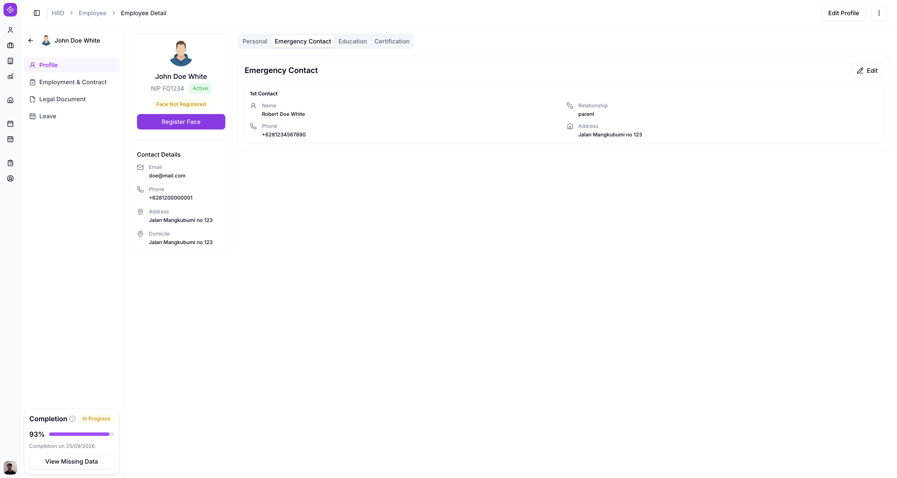
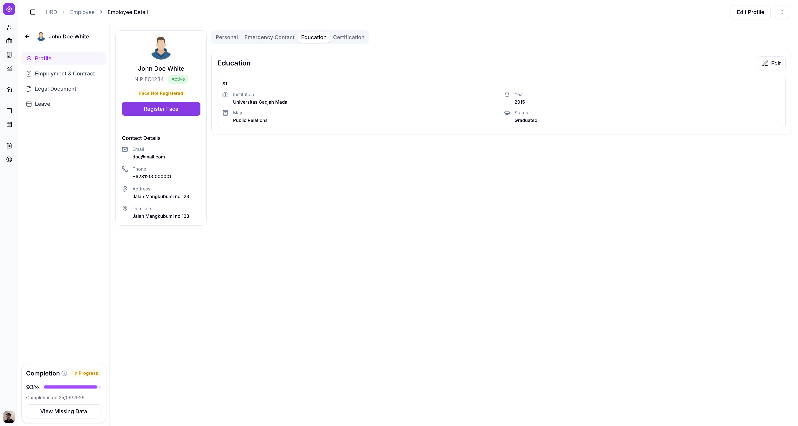
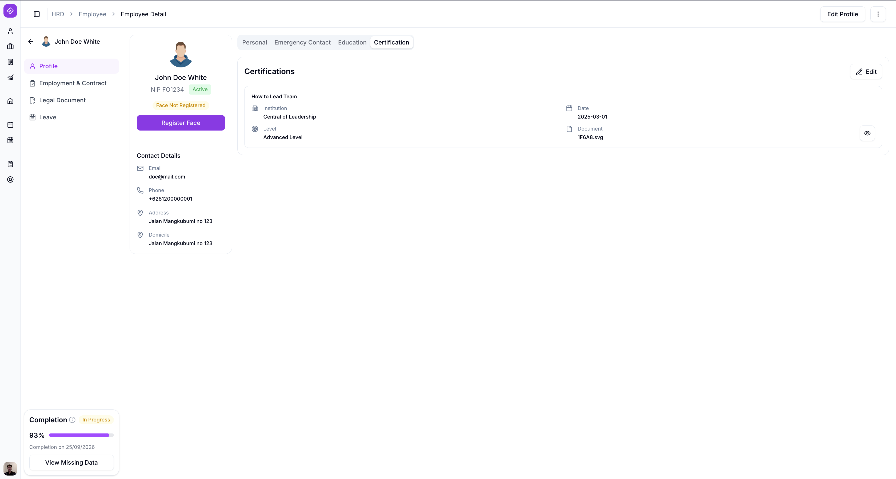

# Employee Detail

Employee Detail menampilkan seluruh informasi lengkap satu karyawan, diakses dari halaman Employee List.

## Ringkasan

Halaman ini terdiri dari navigasi sisi kiri (Profile, Employment & Contract, Legal Document, Leave) dan, di dalam **Profile**, empat tab konten: Personal, Emergency Contact, Education, dan Certification.

## Sebelum memulai

- Anda sudah login sebagai HRD dan berada di halaman [Employee List](employee-list.md).

## Langkah-langkah

### Buka Employee Detail

1. Pada halaman Employee List, ketuk menu titik tiga (**...**) di baris karyawan yang dituju.
2. Pilih **Detail**.

Halaman **Employee Detail** terbuka.

### Navigasi sisi kiri

Halaman Employee Detail punya navigasi sisi kiri dengan empat menu.

| Menu | Keterangan |
| --------------------- | --- |
| Profile | Menampilkan seluruh data personal karyawan, terbagi dalam 4 tab. |
| Employment & Contract | Menampilkan data kepegawaian dan kontrak karyawan. |
| Legal Document | Masih dalam pengembangan. |
| Leave | Masih dalam pengembangan. |

<small>Detail Employment & Contract, serta dokumentasi Legal Document dan Leave setelah tersedia, akan ditambahkan di pembaruan berikutnya.</small>

### Kartu info umum

Di atas keempat tab, ada kartu berisi info umum karyawan: foto profil, nama, NIP, dan status (misalnya `Active`), diikuti bagian **Contact Details** (Email, Phone, Address, Domicile) serta **Completion** yang menunjukkan persentase kelengkapan data dan tombol **View Missing Data**.

Jika karyawan belum melakukan registrasi wajah, tag **Face Not Registered** dan tombol **Register Face** muncul di bawah foto profil.

Setelah registrasi wajah selesai, tag dan tombol tersebut hilang dari kartu.

<small>Lihat [Face Registration](face-registration.md) untuk cara mendaftarkan wajah karyawan.</small>

### Tab Personal

Tab **Personal** menampilkan **Identity Info** karyawan: NIP, Identity Card Type, Place of Birth, Gender, Department, Marital Status, Full Name, Identity Number, Date of Birth, Religion, dan Position.

1. Ketuk tombol **Edit** di pojok kanan atas untuk mengubah data pada tab ini.

### Tab Emergency Contact

Tab **Emergency Contact** menampilkan kontak darurat karyawan: Name, Relationship, Phone, dan Address.

1. Ketuk tombol **Edit** di pojok kanan atas untuk mengubah data pada tab ini.

### Tab Education

Tab **Education** menampilkan riwayat pendidikan karyawan: jenjang (misalnya `S1`), Institution, Major, Year, dan Status.

1. Ketuk tombol **Edit** di pojok kanan atas untuk mengubah data pada tab ini.

### Tab Certification

Tab **Certification** menampilkan riwayat sertifikat karyawan: nama sertifikat, Institution, Level, Date, dan Document.

1. Ketuk tombol **Edit** di pojok kanan atas untuk mengubah data pada tab ini.
2. Ketuk ikon mata di samping **Document** untuk melihat file sertifikat yang diunggah.

## Hasil

Anda bisa melihat seluruh data personal, kontak darurat, pendidikan, dan sertifikasi karyawan dari satu halaman, serta memantau kelengkapan datanya lewat indikator **Completion**.

## Lihat juga

- [Employee Management](README.md)
- [Employee List](employee-list.md)
- [Face Registration](face-registration.md)
- [Edit Employee](edit-employee.md)
