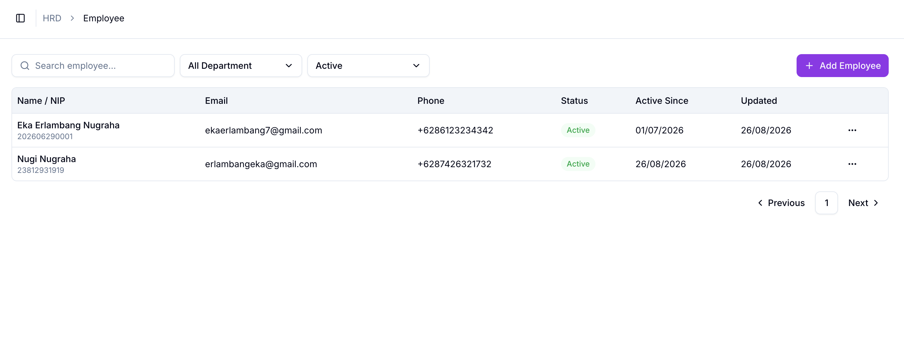

# Employee List

Employee List adalah halaman utama untuk melihat, mencari, dan mengelola seluruh data karyawan yang terdaftar di Willa PMS.

## Ringkasan

Di halaman ini Anda bisa mencari karyawan tertentu, memfilter berdasarkan status atau department, menambah karyawan baru, serta membuka aksi lain untuk setiap karyawan melalui menu titik tiga di tabel.

## Filter dan pencarian

Bagian paling atas halaman berisi alat untuk menyaring data karyawan yang ditampilkan di tabel.

- **Search employee...**: field untuk mencari karyawan dengan kata kunci, misalnya nama atau NIP.
- **Filter status**: menyaring karyawan berdasarkan status — `All Status`, `Active`, `Resign`, `Inactive`, atau `Archive`.
- **Filter department**: menyaring karyawan berdasarkan department, mengikuti data department yang terdaftar di **Department Management**.
- **+ Add Employee**: tombol untuk menambah karyawan baru.

## Kondisi tampilan

Tampilan tabel berubah tergantung jumlah data karyawan yang ada.

### Belum ada karyawan

Jika belum ada satu pun karyawan yang terdaftar, tabel kosong dan tombol **+ Add Employee** menjadi cara utama untuk mulai menambahkan data.

<!-- 🖼️ IMAGE-HINT 01 — assets/01-tabel-employee-kosong.png — Tampilan Employee List saat belum ada data karyawan, dengan tombol +Add Employee -->

### Sudah ada data

Setelah ada karyawan yang terdaftar, tabel menampilkan daftar karyawan sesuai filter yang aktif.

### Data sudah banyak

Jika jumlah karyawan melebihi satu halaman tabel, kontrol pagination di bagian bawah (**Previous**, nomor halaman, **Next**) menjadi aktif untuk berpindah antar halaman data.

## Kolom tabel

| Kolom | Isi |
| ------------- | ------------------------------------------------------------------------ |
| Name / NIP | Nama lengkap karyawan, dengan NIP (Nomor Induk Pegawai) di bawahnya. |
| Email | Alamat email karyawan yang terdaftar. |
| Phone | Nomor telepon karyawan. |
| Status | Status keaktifan karyawan, misalnya `Active`. |
| Active Since | Tanggal karyawan mulai aktif. |
| Updated | Tanggal data karyawan terakhir diperbarui. |

## Aksi cepat (menu titik tiga)

Setiap baris karyawan punya menu titik tiga (**...**) berisi aksi berikut.

- **Detail**: membuka halaman [Employee Detail](employee-detail.md) untuk melihat data lengkap karyawan tersebut.
- **Download URL Code**: mengunduh kode atau tautan unik milik karyawan tersebut.
- **Change Email**: mengubah alamat email yang terdaftar untuk karyawan tersebut.
- **Resign**: mengubah status karyawan menjadi `Resign`.
- **Archive**: mengarsipkan data karyawan, memindahkan statusnya menjadi `Archive`.
- **Face Registration**: membuka halaman [Face Registration](face-registration.md) untuk mendaftarkan atau memperbarui data wajah karyawan.

<small>Detail langkah dari masing-masing aksi di atas akan dijelaskan lebih lanjut di halaman terkait atau di pembaruan berikutnya.</small>

## Lihat juga

- [Employee Management](README.md)
- [Employee Detail](employee-detail.md)
- [Face Registration](face-registration.md)
- [Edit Employee](edit-employee.md)
