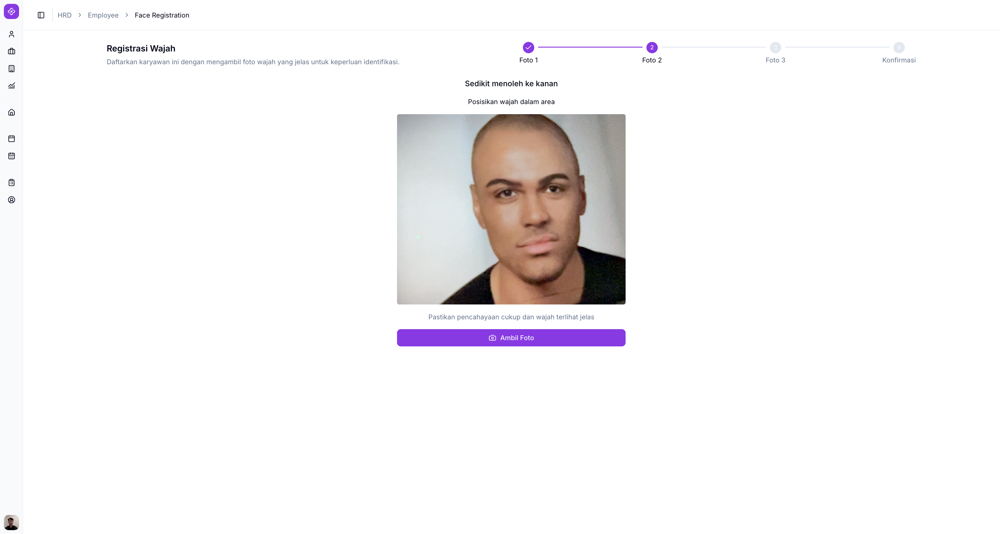
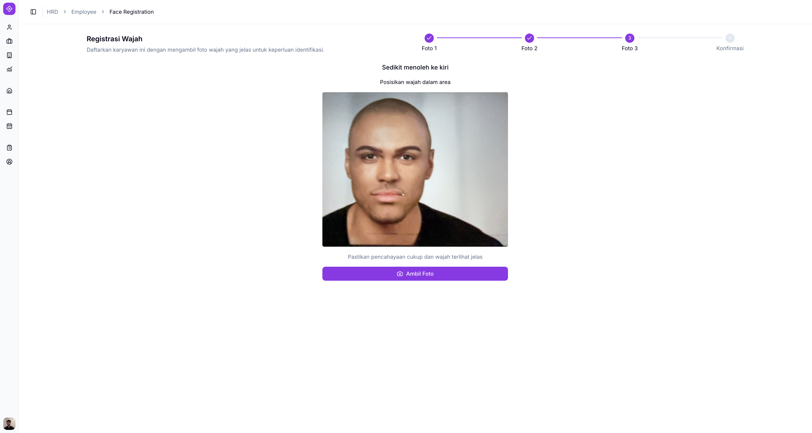
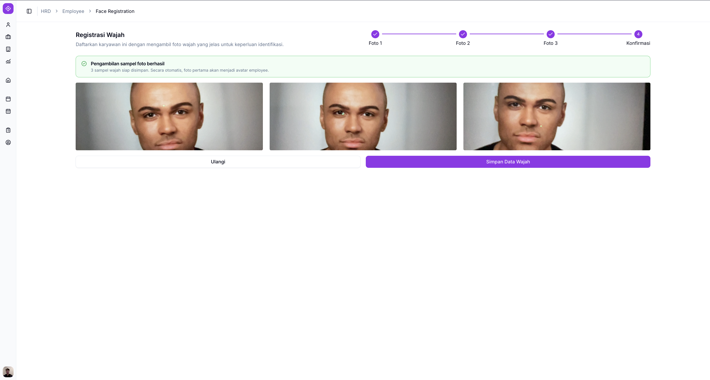
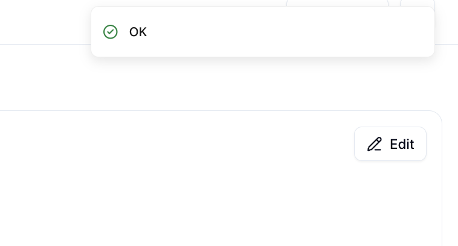
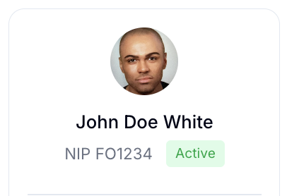

# Face Registration

Face Registration dipakai untuk mendaftarkan data wajah karyawan, menggunakan kamera perangkat Anda. Foto yang diambil otomatis menjadi foto profil karyawan setelah proses selesai.

## Ringkasan

Registrasi dilakukan dalam 4 tahap berurutan: **Foto 1**, **Foto 2**, **Foto 3**, dan **Konfirmasi**. Setiap tahap pengambilan foto punya instruksi posisi wajah yang berbeda, ditampilkan langsung di layar.

## Sebelum memulai

- Perangkat Anda punya kamera yang berfungsi, dan mengizinkan akses kamera untuk Willa PMS.

## Langkah-langkah

### Buka Face Registration

Anda bisa membuka halaman ini dari dua tempat.

1. Dari [Employee List](employee-list.md): ketuk menu titik tiga (**...**) pada baris karyawan, lalu pilih **Face Registration**.
2. Dari [Employee Detail](employee-detail.md): ketuk tombol **Register Face** pada kartu info umum. Tombol ini hanya muncul jika wajah karyawan belum terdaftar.

Halaman **Registrasi Wajah** terbuka dan kamera perangkat aktif, menampilkan stepper 4 tahap: **Foto 1**, **Foto 2**, **Foto 3**, **Konfirmasi**.

### Ambil Foto 1

<!-- 🖼️ IMAGE-HINT 01 — assets/01-foto1.png — Tampilan tahap Foto 1 pada Registrasi Wajah, dengan instruksi posisi wajah dan tombol Ambil Foto -->

1. Posisikan wajah sesuai instruksi yang tampil di layar.
2. Ketuk **Ambil Foto**.

### Ambil Foto 2

Tahap ini meminta Anda menoleh sedikit ke kanan.

1. Posisikan wajah sesuai instruksi **Sedikit menoleh ke kanan**.
2. Ketuk **Ambil Foto**.

### Ambil Foto 3

Tahap ini meminta Anda menoleh sedikit ke kiri.

1. Posisikan wajah sesuai instruksi **Sedikit menoleh ke kiri**.
2. Ketuk **Ambil Foto**.

> ℹ️ **Info:** Ikuti instruksi posisi wajah yang tampil di setiap tahap — arah dan sudut wajah berbeda untuk setiap foto.

### Konfirmasi

Setelah tiga foto diambil, tahap **Konfirmasi** menampilkan ketiga sampel foto wajah Anda.

<small>Foto pertama akan otomatis menjadi foto profil karyawan.</small>

1. Periksa ketiga foto yang diambil.
2. Ketuk **Ulangi** jika ingin mengambil ulang seluruh foto, atau **Simpan Data Wajah** jika sudah sesuai.

## Hasil

Setelah menekan **Simpan Data Wajah**, sistem menampilkan notifikasi berhasil.

Anda kembali ke halaman Employee Detail. Tag **Face Not Registered** dan tombol **Register Face** pada kartu info umum hilang, dan foto pertama otomatis menjadi foto profil karyawan.

## Lihat juga

- [Employee Management](README.md)
- [Employee List](employee-list.md)
- [Employee Detail](employee-detail.md)
