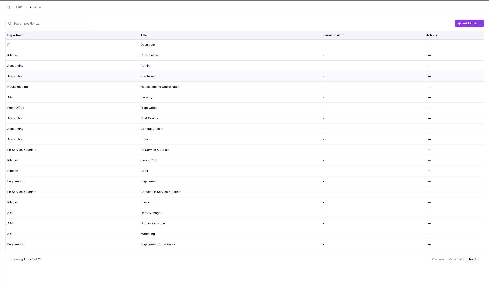
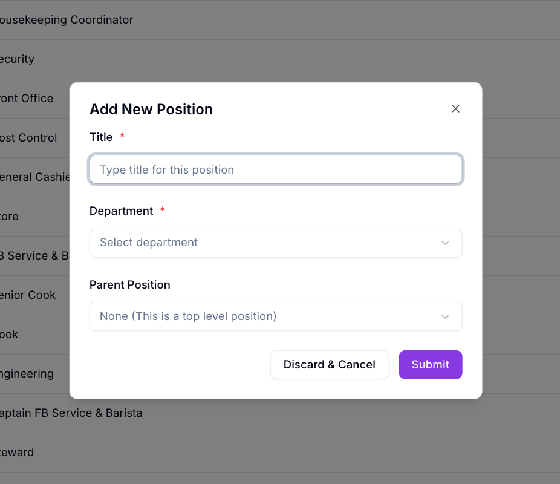
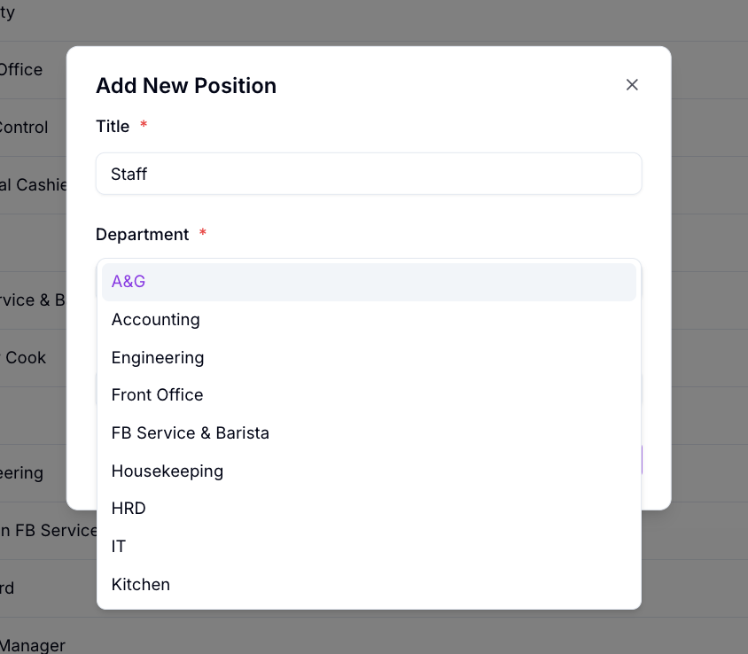
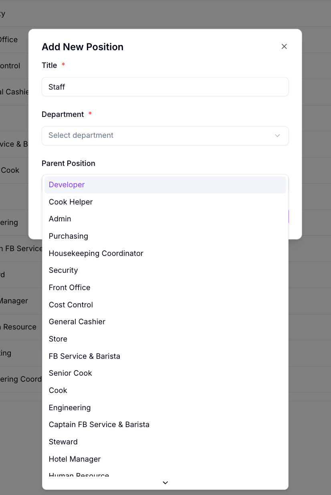
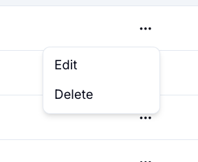
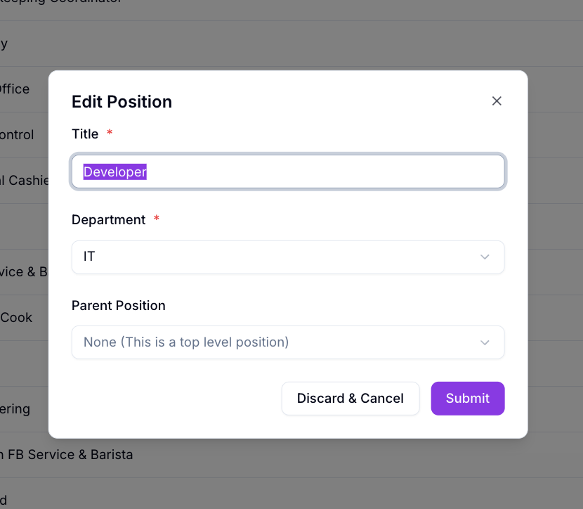

# Management Position

Management Position menampilkan daftar seluruh position (jabatan) di Willa PMS, sekaligus tempat menambah dan mengubah position.

## Ringkasan

Di halaman ini Anda bisa mencari position, menambah position baru lewat **Add Position**, serta mengubah atau menghapus position yang sudah ada lewat menu aksi di tiap baris. Setiap position terhubung ke satu department, dan opsional punya **Parent Position**.

## Sebelum memulai

- Anda login sebagai HRD.
- Department yang akan dipakai sudah terdaftar, lihat [Management Department](../department-management/management-department.md).

## Langkah-langkah

### Buka halaman Position

1. Dari menu navigasi, pilih **Position**.
2. Halaman **Position** terbuka, menampilkan daftar position beserta pencarian dan tombol **+ Add Position** di bagian atas.

### Baca tabel position

Tabel menampilkan kolom berikut.

| Kolom | Isi |
| -------------- | --- |
| Department | Department tempat position ini berada. |
| Title | Nama position. |
| Parent Position | Position di atasnya dalam satu department. Tertulis `-` jika position ini tidak punya atasan (top level position). |
| Actions | Menu aksi untuk position tersebut. |

Di bawah tabel ada keterangan jumlah data dan navigasi halaman: **Previous**, nomor halaman, dan **Next**.

### Cari position

1. Ketik judul position pada kolom **Search positions...**.

### Tambah position baru

1. Ketuk **+ Add Position**.
2. Dialog **Add New Position** terbuka.

| Field | Wajib | Isi |
| -------------- | ----- | --- |
| Title | Ya | Nama position, misalnya `Staff`. |
| Department | Ya | Department tempat position ini berada, dipilih dari daftar. |
| Parent Position | Tidak | Position di atasnya dalam department yang sama, dipilih dari daftar. Defaultnya `None (This is a top level position)`. |

> ℹ️ **Info:** Jika **Parent Position** dibiarkan kosong (`None`), position tersebut dianggap sebagai top level position di department yang dipilih.

1. Isi **Title**.
2. Pilih **Department**.
3. Pilih **Parent Position** jika position ini berada di bawah position lain pada department yang sama. Biarkan **None** jika position ini adalah top level position.
4. Ketuk **Submit** untuk menyimpan, atau **Discard & Cancel** untuk membatalkan.

### Kelola position yang sudah ada

Setiap baris punya menu aksi (ikon titik tiga) pada kolom **Actions**.

| Aksi | Fungsi |
| ------ | --- |
| Edit | Membuka dialog **Edit Position**, terisi data position tersebut, untuk diubah. |
| Delete | Menghapus position tersebut. |

1. Ketuk **Edit** untuk mengubah **Title**, **Department**, dan/atau **Parent Position**, lalu **Submit** untuk menyimpan atau **Discard & Cancel** untuk membatalkan.
2. Ketuk **Delete** untuk menghapus position.

> ⚠️ **Perhatian:** Hapus position hanya jika sudah tidak dipakai. Periksa dulu apakah position tersebut masih menjadi **Parent Position** bagi position lain, atau masih dipakai karyawan.

## Hasil

Position baru tersimpan dan muncul di daftar, siap dipilih sebagai **Parent Position** untuk position lain, maupun sebagai pilihan **Position** di fitur lain, misalnya saat menambah karyawan.

## Lihat juga

- [Position Management](README.md)
- [Employee Management](../employee-management/README.md)
- [Management Department](../department-management/management-department.md)
