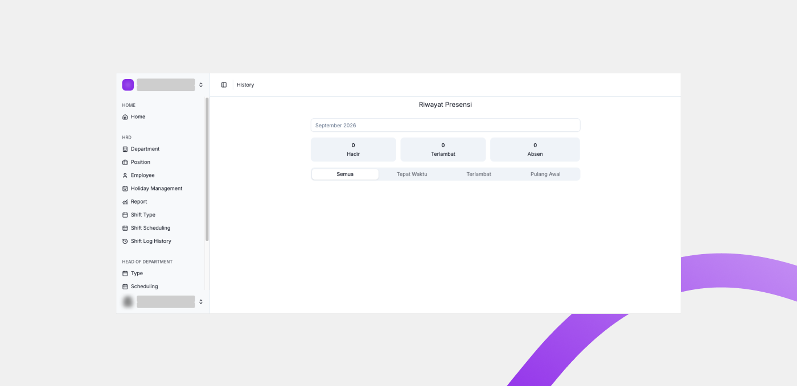

# Log History

Log History adalah halaman **Riwayat Presensi** di Willa PMS. Halaman ini menampilkan rekapitulasi kehadiran karyawan berdasarkan jadwal shift yang sudah berjalan.

## Ringkasan

Di halaman ini Anda bisa melihat ringkasan kehadiran dan menelusuri riwayat presensi karyawan. Data dikelompokkan per bulan dan bisa difilter berdasarkan status kehadiran.

## Sebelum memulai

- Anda login sebagai HOD.
- Karyawan sudah punya jadwal shift, lihat [Scheduling](scheduling.md).

## Langkah-langkah

### Buka halaman Riwayat Presensi

1. Dari menu navigasi, pilih **History**.
2. Halaman **History** terbuka dengan judul **Riwayat Presensi**.

### Baca ringkasan kehadiran

Di bagian atas halaman terdapat tiga kartu ringkasan.

| Kartu | Arti |
| ----- | ---- |
| Hadir | Jumlah kehadiran karyawan pada periode terpilih. |
| Terlambat | Jumlah keterlambatan karyawan pada periode terpilih. |
| Absen | Jumlah ketidakhadiran karyawan pada periode terpilih. |

### Pilih periode

1. Ketuk pemilih bulan di bagian atas halaman.
2. Pilih bulan yang ingin ditinjau, misalnya `September 2026`.

### Filter berdasarkan status

Riwayat presensi bisa disaring dengan tab berikut.

| Tab | Isi |
| --- | --- |
| Semua | Seluruh riwayat presensi. |
| Tepat Waktu | Presensi yang tercatat tepat waktu. |
| Terlambat | Presensi yang tercatat terlambat. |
| Pulang Awal | Presensi yang tercatat pulang sebelum jam shift berakhir. |

## Hasil

Riwayat presensi tampil sesuai bulan dan status yang dipilih, sehingga Anda bisa menilai apakah jadwal shift berjalan sebagaimana mestinya.

## Lihat juga

- [Shift Management](README.md)
- [Shift Type](shift-type.md)
- [Scheduling](scheduling.md)
