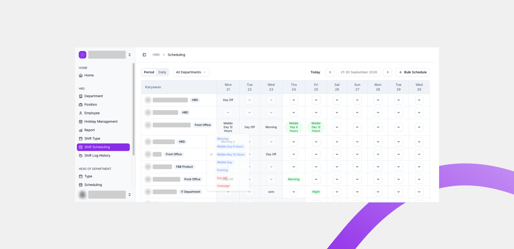
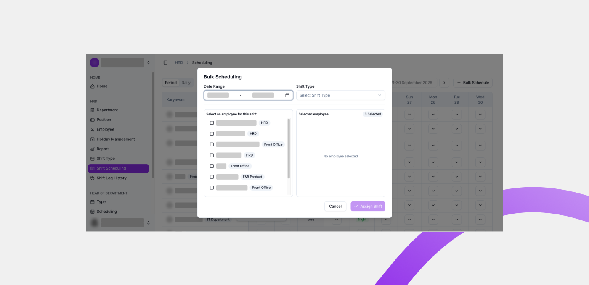

# Scheduling

Scheduling adalah halaman untuk menyusun jadwal shift karyawan di Willa PMS. Anda memakai halaman ini untuk menetapkan shift setiap karyawan pada setiap tanggal.

## Ringkasan

Halaman Scheduling menampilkan tabel dengan kolom **Karyawan** dan kolom tanggal. Anda bisa mengganti periode, memfilter berdasarkan department, memilih mode tampilan, dan mengisi shift pada sel tanggal. Shift yang bisa dipilih berasal dari shift type yang sudah dibuat, lihat [Shift Type](shift-type.md).

## Sebelum memulai

- Anda login sebagai HOD.
- Minimal satu shift type sudah dibuat, lihat [Shift Type](shift-type.md).
- Anda sudah mengetahui department dan periode yang akan dijadwalkan.

## Langkah-langkah

### Buka halaman Scheduling

1. Dari menu navigasi, pilih **Scheduling**.
2. Halaman **Scheduling** terbuka dan menampilkan tabel jadwal beserta kontrol di bagian atas.

### Kenali kontrol halaman

Sebelum menjadwalkan, kenali kontrol yang tersedia di bagian atas halaman.

| Kontrol | Fungsi |
| ------- | ------ |
| Period / Daily | Mode tampilan jadwal. **Period** menampilkan rentang tanggal penuh, **Daily** menampilkan jadwal per hari. |
| All Departments | Memfilter tabel hanya untuk department tertentu, atau menampilkan semua department. |
| Bulk Schedule | Menetapkan shift untuk banyak karyawan sekaligus. |
| Today | Melompat ke jadwal tanggal hari ini. |
| Periode | Menentukan rentang tanggal yang ditampilkan, misalnya `21-30 September 2026`. |

### Baca tabel jadwal

Tabel jadwal terdiri dari dua bagian.

| Bagian | Isi |
| ------ | --- |
| Kolom Karyawan | Inisial, nama, dan department tiap karyawan. |
| Kolom tanggal | Satu kolom untuk setiap tanggal pada periode, misalnya `Mon 21` dan `Tue 22`. |

Setiap sel tanggal berisi tombol yang membuka daftar shift. Jika shift type belum dibuat untuk department tersebut, tombol ini tidak aktif dan jadwal tidak bisa diisi.

### Isi shift pada sel tanggal

1. Ketuk tombol di dalam sel tanggal untuk karyawan yang dituju.
2. Daftar shift yang tersedia terbuka.
3. Pilih shift yang ingin ditetapkan pada tanggal tersebut.

Selain shift type yang sudah dibuat, daftar ini selalu menyediakan dua pilihan.

| Pilihan | Fungsi |
| ------- | ------ |
| Day Off | Menandai karyawan libur pada tanggal tersebut. |
| Unassign | Menghapus shift yang sudah ditetapkan pada sel tersebut. |

### Jadwalkan banyak karyawan sekaligus

1. Ketuk **Bulk Schedule**.
2. Dialog **Bulk Scheduling** terbuka.

3. Isi dialog sesuai tabel berikut.

| Bagian | Isi |
| ------ | --- |
| Date Range | Rentang tanggal yang akan dijadwalkan. |
| Shift Type | Shift yang akan ditetapkan. |
| Select an employee for this shift | Daftar karyawan yang bisa dipilih. Centang satu atau lebih. |
| Selected employee | Karyawan yang sudah dipilih, beserta jumlahnya. |

4. Ketuk **Assign Shift** untuk menyimpan, atau **Cancel** untuk membatalkan.

### Atur filter dan periode

1. Pilih **All Departments** untuk membatasi tabel pada satu department.
2. Sesuaikan periode untuk menampilkan rentang tanggal lain.
3. Ketuk **Today** untuk kembali ke jadwal hari ini.

## Hasil

Shift yang sudah diisi tampil pada sel tanggal terkait di tabel jadwal. Setelah jadwal berjalan, hasil presensi karyawan dapat ditinjau di halaman [Log History](log-history.md).

## Lihat juga

- [Shift Management](README.md)
- [Shift Type](shift-type.md)
- [Log History](log-history.md)
