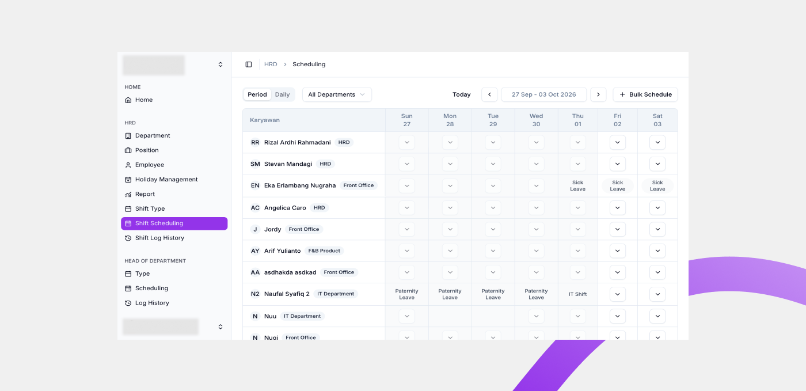
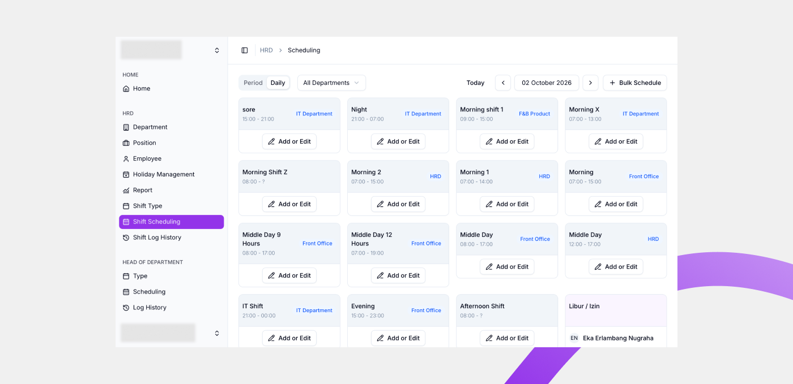
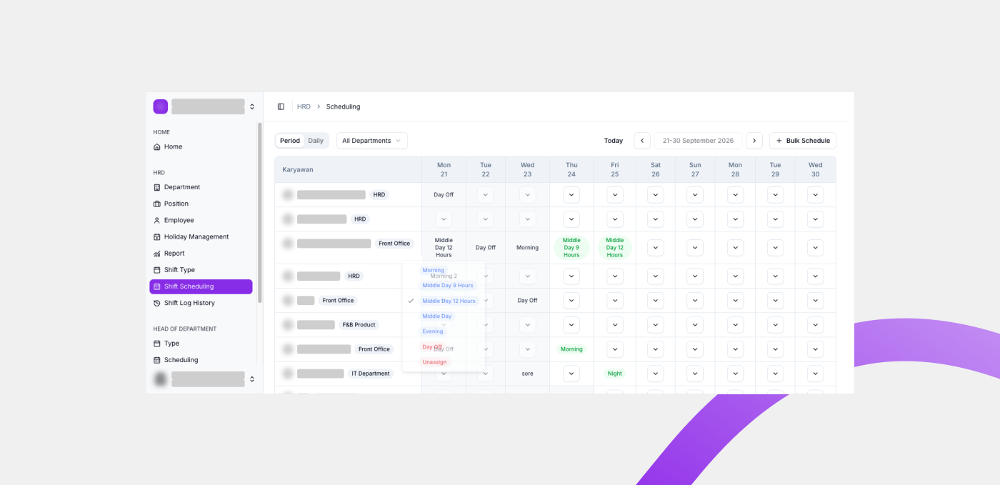
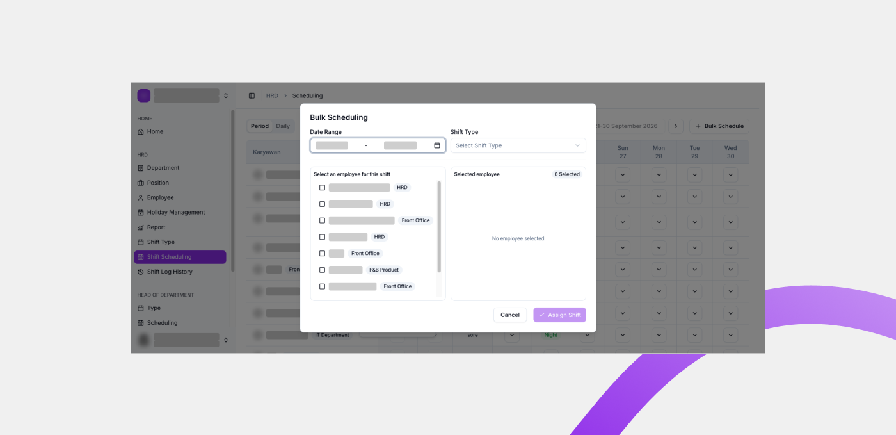

# Scheduling

Scheduling adalah halaman untuk menyusun jadwal shift karyawan di Willa PMS. Anda memakai halaman ini untuk menetapkan shift setiap karyawan pada setiap tanggal.

## Ringkasan

Halaman Scheduling menampilkan tabel dengan kolom **Karyawan** dan kolom tanggal. Anda bisa mengganti periode, memfilter berdasarkan department, memilih mode tampilan, dan mengisi shift pada sel tanggal. Shift yang bisa dipilih berasal dari shift type yang sudah dibuat, lihat [Shift Type](shift-type.md).

## Sebelum memulai

- Anda login sebagai HOD.
- Minimal satu shift type sudah dibuat, lihat [Shift Type](shift-type.md).
- Anda sudah mengetahui department dan periode yang akan dijadwalkan.

## Langkah-langkah

### Buka halaman

1. Dari menu navigasi, pilih **Scheduling**.
2. Halaman **Scheduling** terbuka dan menampilkan tabel jadwal beserta kontrol di bagian atas.

### Atur tampilan dan periode

Di bagian atas halaman tersedia kontrol untuk mengatur cara jadwal ditampilkan. Anda bisa berpindah antara **Period** dan **Daily**, memfilter dengan **All Departments**, menyesuaikan periode, dan menekan **Today** untuk kembali ke jadwal hari ini.

#### Period

**Period** menampilkan rentang tanggal penuh dalam satu tabel. Tiap karyawan punya satu baris dengan satu kolom untuk setiap tanggal pada periode tersebut.

#### Daily

**Daily** menampilkan jadwal per hari. Tampilan ini memudahkan Anda melihat siapa saja yang bertugas pada satu tanggal tertentu.

### Pahami informasi jadwal

Sebelum mengisi jadwal, pahami informasi yang tampil pada tabel.

#### Employee

Kolom karyawan menampilkan inisial, nama, dan department tiap karyawan.

#### Department

Department menentukan shift mana yang tersedia untuk dijadwalkan. Gunakan **All Departments** untuk membatasi tabel pada satu department.

#### Shift

Setiap sel tanggal menampilkan shift yang sudah ditetapkan. Sel yang belum diisi masih kosong dan siap dijadwalkan.

#### Status

Selain shift, sel tanggal bisa menampilkan status khusus seperti **Day Off** untuk hari libur.

### Assign shift

Penugasan shift dilakukan oleh HOD langsung pada sel tanggal karyawan.

#### Pilih employee dan tanggal

1. Cari baris karyawan yang dituju.
2. Tentukan tanggal pada kolom tanggal yang sesuai.

#### Pilih shift

1. Ketuk tombol di dalam sel tanggal untuk karyawan tersebut.
2. Daftar shift yang tersedia terbuka.
3. Pilih shift yang ingin ditetapkan.

Selain shift type yang sudah dibuat, daftar ini selalu menyediakan dua pilihan.

| Pilihan | Fungsi |
| ------- | ------ |
| Day Off | Menandai karyawan libur pada tanggal tersebut. |
| Unassign | Menghapus shift yang sudah ditetapkan pada sel tersebut. |

#### Simpan assignment

Setelah shift dipilih, sel tanggal langsung diperbarui. Ulangi langkah yang sama untuk tanggal dan karyawan lain, atau ketuk **Today** untuk kembali ke jadwal hari ini.

### Bulk schedule

Gunakan **Bulk Schedule** untuk menetapkan shift yang sama kepada banyak karyawan sekaligus.

1. Ketuk **Bulk Schedule**.
2. Dialog **Bulk Scheduling** terbuka.

3. Isi dialog sesuai tabel berikut.

| Bagian | Isi |
| ------ | --- |
| Date Range | Rentang tanggal yang akan dijadwalkan. |
| Shift Type | Shift yang akan ditetapkan. |
| Select an employee for this shift | Daftar karyawan yang bisa dipilih. Centang satu atau lebih. |
| Selected employee | Karyawan yang sudah dipilih, beserta jumlahnya. |

#### Pilih employee

Centang satu atau beberapa karyawan pada daftar **Select an employee for this shift**. Karyawan yang dipilih tampil pada bagian **Selected employee**.

#### Tentukan periode

Isi **Date Range** dengan rentang tanggal yang akan dijadwalkan.

#### Pilih shift

Pilih **Shift Type** yang akan ditetapkan kepada karyawan terpilih.

#### Simpan schedule

Ketuk **Assign Shift** untuk menyimpan, atau **Cancel** untuk membatalkan. Shift terpasang pada semua tanggal dalam rentang untuk karyawan yang dipilih.

### Tangani konflik jadwal

Satu karyawan tidak boleh memiliki dua shift yang saling bertumpang tindih pada waktu yang sama. Sebelum menyimpan, periksa sel tanggal yang bertanda konflik agar jadwal tetap konsisten.

> ⚠️ **Perhatian:** Assignment yang menimbulkan konflik jadwal ditandai sebelum disimpan. Selesaikan konflik terlebih dahulu agar shift tidak saling bertumpang tindih.

## Hasil

Shift yang sudah diisi tampil pada sel tanggal terkait di tabel jadwal. Setelah jadwal berjalan, hasil presensi karyawan dapat ditinjau di halaman [Log History](log-history.md).

## Lihat juga

- [Shift Management](README.md)
- [Shift Type](shift-type.md)
- [Log History](log-history.md)
