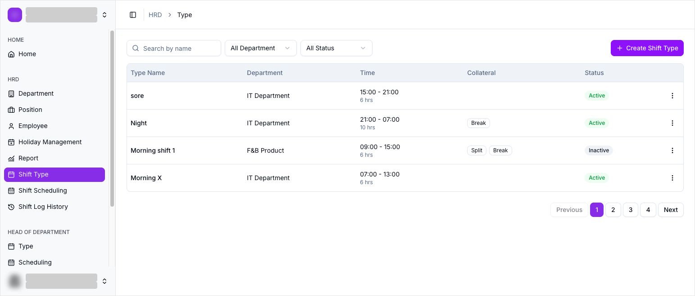
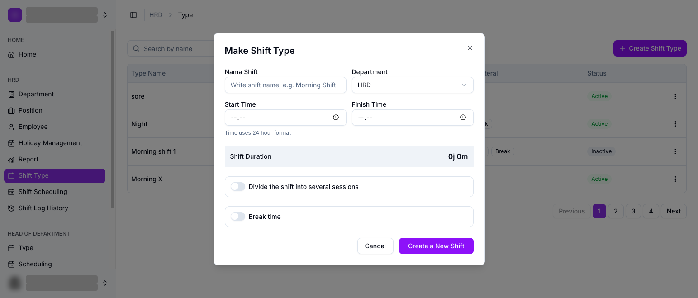
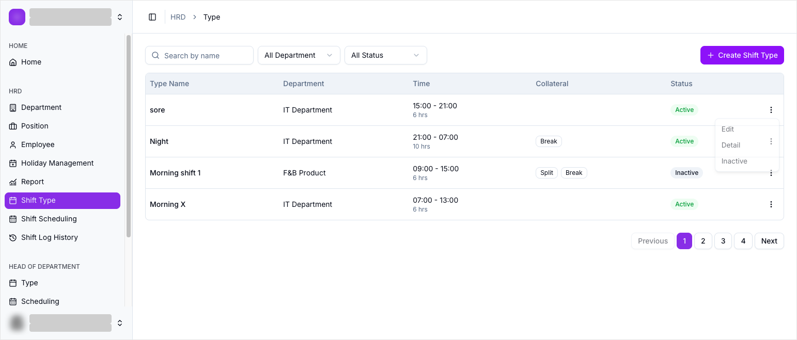

# Shift Type

Shift Type adalah halaman untuk membuat dan mengelola jenis shift kerja, misalnya shift pagi atau shift malam. Shift Type menjadi dasar sebelum Anda menjadwalkan karyawan di halaman [Scheduling](scheduling.md).

## Ringkasan

Di halaman ini Anda bisa melihat daftar shift type, mencari berdasarkan nama, memfilter berdasarkan department dan status, serta membuat shift type baru. Saat membuat shift type, Anda menentukan nama shift, department, jam mulai, jam selesai, dan waktu istirahatnya.

## Sebelum memulai

- Anda login sebagai HOD.
- Anda sudah mengetahui department yang akan memakai shift tersebut.

## Langkah-langkah

### Buka halaman Type

1. Dari menu navigasi, pilih **Type**.
2. Halaman **Type** terbuka dan menampilkan daftar shift type beserta filter di bagian atas.

### Baca tabel shift type

Tabel menampilkan kolom berikut.

| Kolom | Isi |
| ----- | --- |
| Type Name | Nama jenis shift. |
| Department | Department yang memakai shift ini. |
| Time | Jam mulai sampai jam selesai, plus durasi, misalnya `15:00 - 21:00` dan `6 hrs`. |
| Collateral | Penanda **Split** dan **Break** bila shift dibagi sesi atau punya waktu istirahat. |
| Status | **Active** atau **Inactive**. |

Di bawah tabel ada navigasi halaman: **Previous**, nomor halaman, dan **Next**.

### Cari dan filter daftar shift type

Di bagian atas halaman tersedia pencarian dan dua filter.

| Kontrol | Isi |
| ------- | --- |
| Search by name | Mencari shift type berdasarkan namanya. |
| All Department | Menampilkan shift type untuk department tertentu, atau semua department. |
| All Status | Menampilkan shift type berdasarkan status **Active** atau **Inactive**. |

### Buat shift type baru

1. Ketuk **Create Shift Type**.
2. Dialog **Make Shift Type** terbuka.

3. Isi field pada dialog sesuai tabel berikut.

| Field | Wajib | Isi |
| ----- | ----- | --- |
| Nama Shift | Ya | Nama jenis shift, misalnya `Morning Shift`. |
| Department | Ya | Department yang memakai shift ini. |
| Start Time | Ya | Jam shift dimulai, memakai format 24 jam. |
| Finish Time | Ya | Jam shift berakhir, memakai format 24 jam. |
| Shift Duration | Otomatis | Durasi shift yang dihitung otomatis dari **Start Time** dan **Finish Time**, misalnya `0j 0m`. |
| Divide the shift into several sessions | Tidak | Sakelar untuk membagi shift menjadi beberapa sesi. |
| Break time | Tidak | Waktu istirahat di dalam shift. |

4. Ketuk **Create a New Shift** untuk menyimpan, atau **Cancel** untuk membatalkan.

<small>**Shift Duration** terisi otomatis setelah Anda mengisi **Start Time** dan **Finish Time**.</small>

> ⚠️ **Perhatian:** Aktifkan **Divide the shift into several sessions** hanya jika satu shift punya lebih dari satu sesi kerja. Untuk shift biasa, biarkan nonaktif.

### Kelola shift type yang sudah ada

Tiap baris punya menu aksi (ikon tiga titik) di ujung kanan.

| Aksi | Fungsi |
| ---- | ------ |
| Edit | Mengubah data shift type. |
| Detail | Melihat rincian shift type. |
| Inactive | Menonaktifkan shift type. Shift type yang nonaktif tidak bisa dipakai untuk jadwal baru. |

## Hasil

Shift type baru tersimpan dan muncul di daftar halaman **Type**. Shift type tersebut siap dipakai saat Anda menjadwalkan karyawan di halaman [Scheduling](scheduling.md).

## Lihat juga

- [Shift Management](README.md)
- [Scheduling](scheduling.md)
- [Log History](log-history.md)
