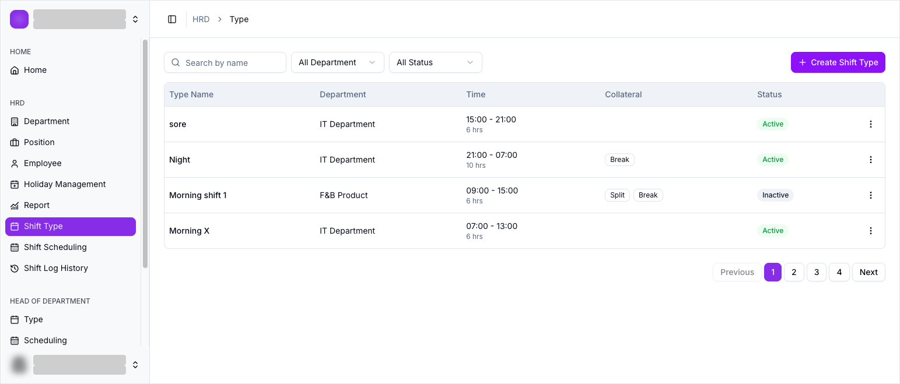
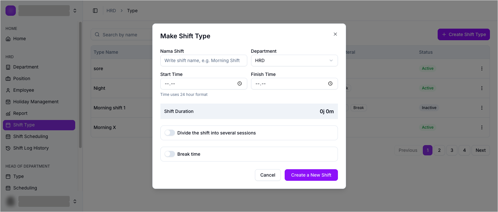
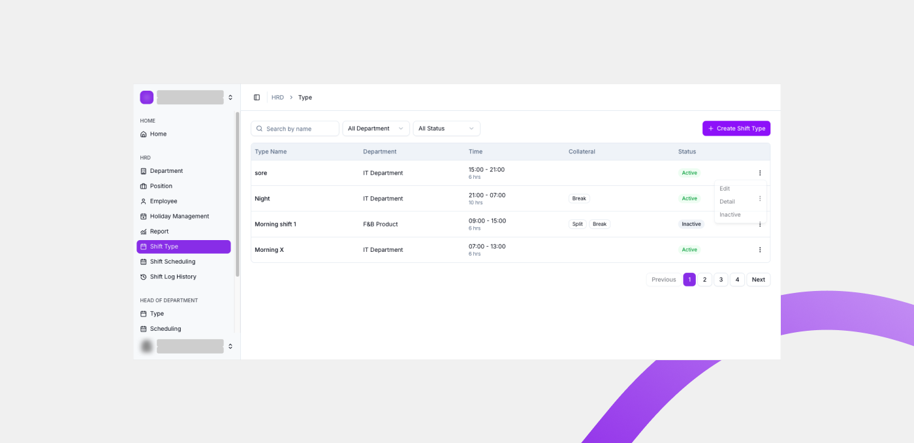
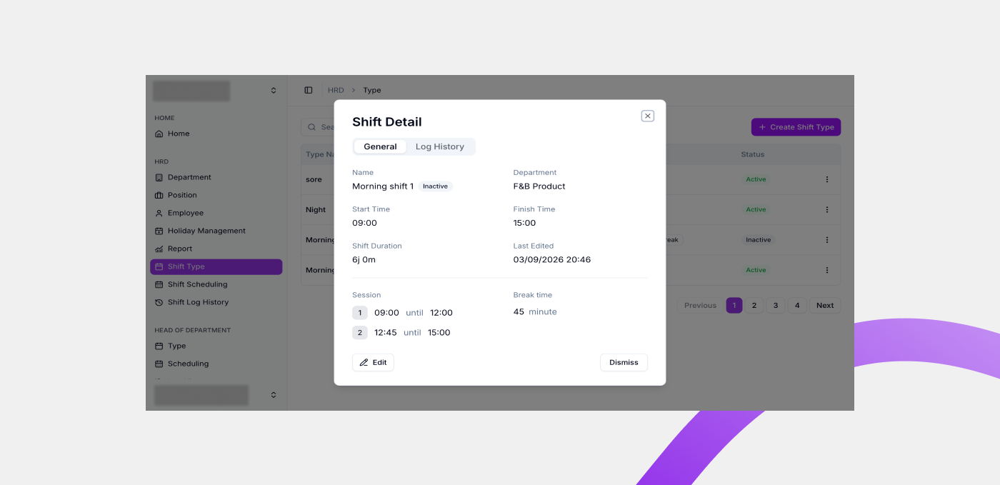
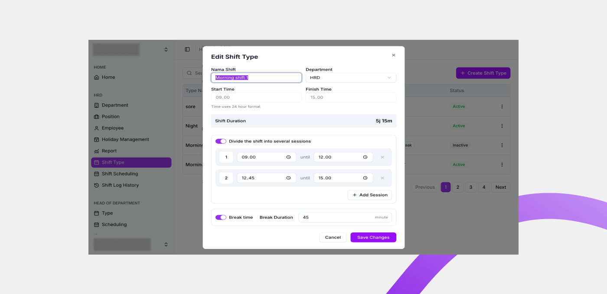
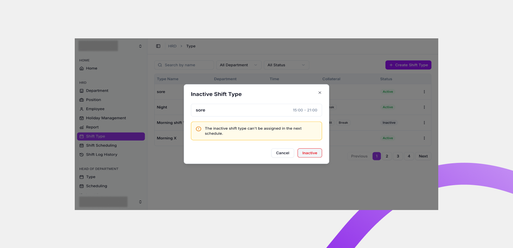
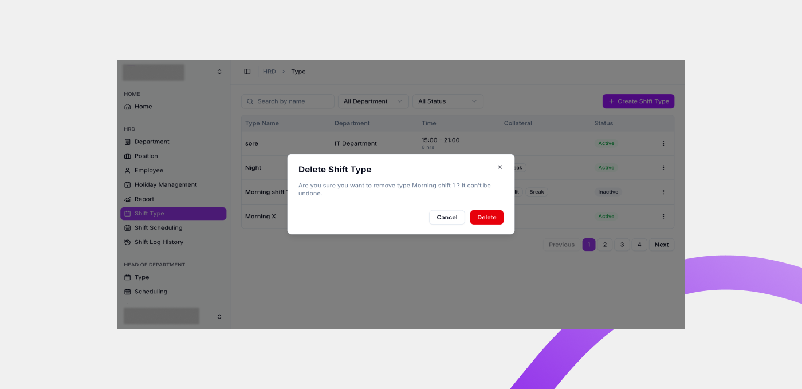

# Shift Type (Master Shift)

Shift Type digunakan untuk mengatur dan mengelola shift kerja yang dapat digunakan secara berulang pada masing-masing department.

## Ringkasan

Di halaman ini Anda bisa melihat daftar shift type, mencari berdasarkan nama, memfilter berdasarkan department dan status, serta membuat shift type baru. Saat membuat shift type, Anda menentukan nama shift, department, jam mulai, jam selesai, dan waktu istirahatnya.

## Sebelum memulai

- Anda login sebagai **HR atau HOD** dengan permission untuk mengelola shift.
- Anda sudah mengetahui department yang akan menggunakan shift tersebut.

## Langkah-langkah

### Buka halaman Shift Type

1. Dari menu navigasi, pilih **Type**.
2. Halaman **Type** terbuka dan menampilkan daftar shift type beserta filter di bagian atas.

### Baca tabel Shift Type

Tabel menampilkan kolom berikut.

| Kolom | Isi |
| ----- | --- |
| Type Name | Nama jenis shift. |
| Department | Department yang memakai shift ini. |
| Time | Jam mulai sampai jam selesai, plus durasi, misalnya `15:00 - 21:00` dan `6 hrs`. |
| Collateral | Penanda **Split** dan **Break** bila shift dibagi sesi atau punya waktu istirahat. |
| Status | **Active** atau **Inactive**. |

Di bawah tabel ada navigasi halaman: **Previous**, nomor halaman, dan **Next**.

### Cari dan filter daftar Shift Type

Di bagian atas halaman tersedia pencarian dan dua filter.

| Kontrol | Isi |
| ------- | --- |
| Search by name | Mencari shift type berdasarkan namanya. |
| All Department | Menampilkan shift type untuk department tertentu, atau semua department. |
| All Status | Menampilkan shift type berdasarkan status **Active** atau **Inactive**. |

### Buat Shift Type baru

1. Ketuk **Create Shift Type**.
2. Dialog **Make Shift Type** terbuka.

3. Isi field pada dialog sesuai tabel berikut.

| Field | Wajib | Isi |
| ----- | ----- | --- |
| Nama Shift | Ya | Nama jenis shift, misalnya `Morning Shift`. |
| Department | Ya | Department yang memakai shift ini. |
| Start Time | Ya | Jam shift dimulai, memakai format 24 jam. |
| Finish Time | Ya | Jam shift berakhir, memakai format 24 jam. |
| Shift Duration | Otomatis | Durasi shift yang dihitung otomatis dari **Start Time** dan **Finish Time**, misalnya `0j 0m`. |
| Divide the shift into several sessions | Tidak | Sakelar untuk membagi shift menjadi beberapa sesi. |
| Break time | Tidak | Waktu istirahat di dalam shift. |

4. Ketuk **Create a New Shift** untuk menyimpan, atau **Cancel** untuk membatalkan.

> ⚠️ **Perhatian:** Aktifkan **Divide the shift into several sessions** hanya jika satu shift punya lebih dari satu sesi kerja. Untuk shift biasa, biarkan nonaktif.

### Kelola Shift Type yang sudah ada

Tiap baris punya menu aksi (ikon tiga titik) di ujung kanan. Menu ini dipakai untuk melihat rincian, mengubah, menonaktifkan, atau menghapus shift type.

| Aksi | Fungsi |
| ---- | ------ |
| Detail | Melihat rincian shift type tanpa mengubah data. |
| Edit | Mengubah data shift type. |
| Inactive | Menonaktifkan shift type. Shift type yang nonaktif tidak bisa dipakai untuk jadwal baru. |
| Delete | Menghapus shift type secara permanen. Opsi ini hanya muncul saat shift type berstatus **Inactive**. |

> ℹ️ **Info:** Opsi **Delete** disembunyikan selama shift type masih berstatus **Active**. Nonaktifkan shift type terlebih dahulu agar tidak ada shift aktif yang terhapus dari jadwal.

#### Menampilkan detail shift

Fitur ini dipakai untuk melihat rincian informasi suatu shift secara lengkap tanpa mengubah data.

1. Masuk ke halaman **Type**.
2. Pilih department atau gunakan kolom pencarian dan filter untuk menemukan shift yang dituju.
3. Ketuk ikon aksi (⋮) pada baris shift yang sesuai.
4. Pilih **Detail**.
5. Jendela informasi **Detail Shift** terbuka dan menampilkan rincian data secara read-only.

Informasi yang ditampilkan sebagai berikut.

| Informasi | Isi |
| --------- | --- |
| Department | Nama department pemilik shift, misalnya Front Office. |
| Shift Name | Nama shift, misalnya Morning Shift. |
| Shift Code | Kode unik shift, misalnya `MORNING`. |
| Start Time & End Time | Jam mulai dan jam selesai shift dengan format `HH:mm`, misalnya `07:00 - 15:00`. |
| Overnight | Indikator apakah shift melewati tengah malam, **Yes** atau **No**. |
| Shift Duration | Durasi jam kerja yang dihitung otomatis oleh sistem, misalnya `8 Hours`. |
| Status | Status keaktifan shift, **Active** atau **Inactive**. |
| Description | Keterangan tambahan mengenai operasional shift. |

#### Mengubah data shift

Fitur ini dipakai untuk memperbarui rincian atau konfigurasi waktu operasional shift yang sudah ada.

1. Pada halaman **Type**, cari data shift yang akan diubah.
2. Ketuk ikon aksi (⋮) pada kolom aksi di kanan baris shift.
3. Pilih **Edit**.
4. Formulir **Edit Shift** terbuka dan menampilkan data saat ini.
5. Perbarui informasi yang diperlukan, seperti **Shift Name**, **Shift Code**, **Start Time**, **End Time**, **Overnight**, **Status**, atau **Description**.
6. Ketuk **Save Changes** untuk menyimpan perubahan, atau **Cancel** untuk membatalkan.

Aturan dan validasi sistem sebagai berikut.

| Aturan | Penjelasan |
| ------ | ---------- |
| Keunikan nama dan kode | Nama dan kode shift harus unik di dalam satu department. |
| Validasi waktu lintas hari | Jika jam kerja melewati tengah malam, misalnya `23:00` sampai `07:00`, penanda **Overnight** wajib diatur ke **Yes**. Jika diatur ke **No**, sistem menolak penyimpanan. |
| Perhitungan durasi otomatis | Durasi shift dihitung otomatis dari **Start Time**, **End Time**, dan penanda **Overnight**. |
| Perlakuan data historis | Perubahan master shift hanya berdampak pada jadwal baru di masa mendatang dan tidak mengubah riwayat jadwal yang sudah dibuat. |

#### Menonaktifkan shift

Fitur ini dipakai saat suatu shift tidak lagi dipakai untuk penjadwalan baru, tetapi masih tersimpan dalam riwayat penjadwalan.

1. Cari shift yang ingin dinonaktifkan pada daftar **Type**.
2. Ketuk ikon aksi (⋮), lalu pilih **Inactive**.
3. Konfirmasi tindakan penonaktifan pada dialog yang muncul.

Dampak status **Inactive** sebagai berikut.

- Status shift berubah dari **Active** menjadi **Inactive**.
- Shift berstatus **Inactive** tidak muncul sebagai pilihan saat menyusun jadwal karyawan baru di halaman [Scheduling](scheduling.md).
- Riwayat penjadwalan dan kehadiran terdahulu yang memakai shift ini tetap tersimpan.

#### Menghapus shift

Fitur ini dipakai untuk menghapus master shift secara permanen. Opsi **Delete** hanya tersedia saat shift berstatus **Inactive** dan belum terikat pada data jadwal maupun kehadiran.

1. Ketuk ikon aksi (⋮) pada baris shift yang ingin dihapus di daftar **Type**.
2. Pilih **Delete**.
3. Sistem melakukan pengecekan keterkaitan data (dependency check).

Hasil pengecekan menentukan langkah berikutnya.

- **Belum pernah digunakan:** jendela konfirmasi penghapusan muncul. Ketuk **Delete** untuk menghapus data dari sistem secara permanen.
- **Sudah pernah digunakan pada jadwal atau kehadiran:** sistem menolak penghapusan secara otomatis dan menampilkan pesan berikut.

> ⚠️ **Perhatian:** Sistem menolak penghapusan dengan pesan "This shift cannot be deleted because it is already used by employee schedules. You can deactivate this shift instead." Gunakan **Inactive** agar data historis tidak terganggu.

### Gunakan Shift Type untuk Scheduling

Setelah shift type tersimpan, shift tersebut siap dipakai saat Anda menjadwalkan karyawan. Buka halaman [Scheduling](scheduling.md) dan pilih shift type pada sel tanggal karyawan.

## Hasil

Shift type baru tersimpan dan muncul di daftar halaman **Type**. Shift type tersebut, sebagai master shift, siap dipakai saat Anda menjadwalkan karyawan di halaman [Scheduling](scheduling.md).

## Lihat juga

- [Shift Management](README.md)
- [Scheduling](scheduling.md)
- [Log History](log-history.md)
