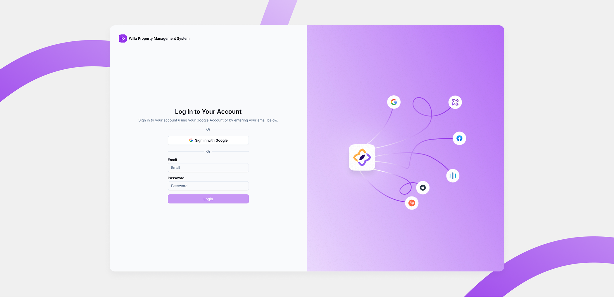
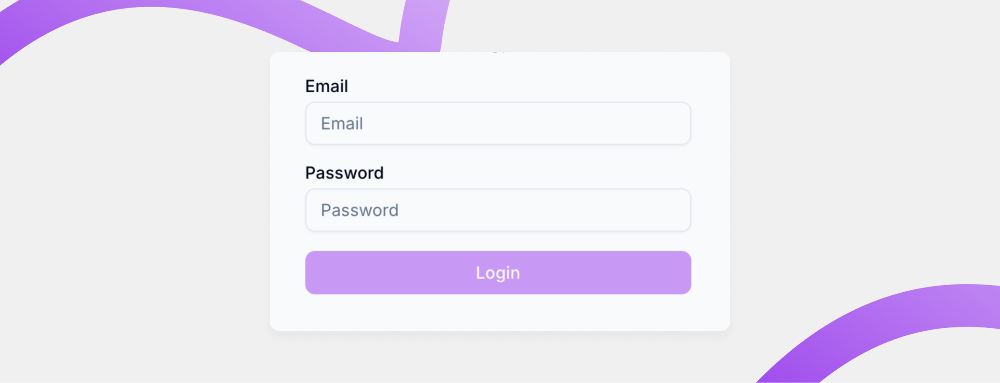
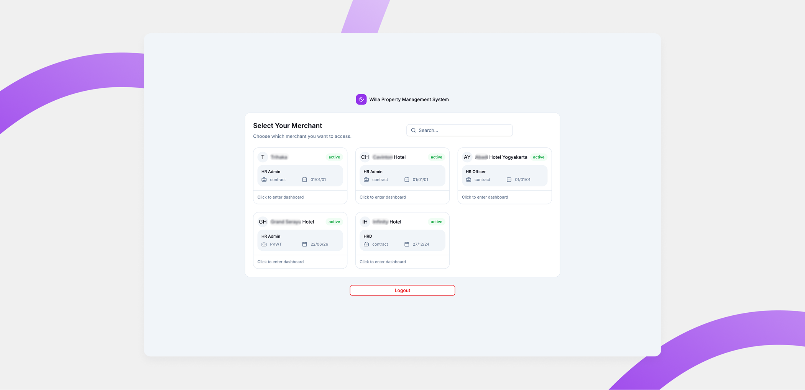

# Login dan Aktivasi Akun

Halaman ini menjelaskan cara login ke Willa PMS untuk semua peran, menggunakan akun Google atau email dan password yang sudah terdaftar.

## Ringkasan

Anda bisa login ke Willa PMS dengan dua cara: menggunakan akun Google, atau menggunakan email dan password yang sudah didaftarkan. Halaman tujuan setelah login berhasil berbeda menurut peran Anda.

## Sebelum memulai

- Koneksi internet aktif dan browser versi terbaru.
- Salah satu dari: akun Google yang terdaftar di Willa PMS, atau email dan password yang sudah didaftarkan.

<small>Lihat [Akses aplikasi via browser](akses-aplikasi.md) untuk informasi siapa yang mendaftarkan email Anda.</small>

## Langkah-langkah

### Buka halaman login

1. Buka browser di perangkat Anda.
2. Kunjungi `pms.willa.com`.

### Login dengan akun Google

1. Ketuk tombol **Sign in with Google**.
2. Pilih akun Google yang terdaftar di Willa PMS.

### Login dengan email dan password

1. Isi kolom **Email** dengan alamat email Anda.
2. Isi kolom **Password** dengan kata sandi Anda.
3. Ketuk tombol **Login**.

> ⚠️ **Perhatian:** Jika email tidak terdaftar atau password yang Anda masukkan salah, Anda tidak bisa masuk. Sistem menampilkan pesan kesalahan dan meminta Anda mencoba lagi.

### Pilih merchant (khusus HRD dengan multiple akun)

Jika Anda login sebagai HRD dan memiliki lebih dari satu akun merchant, Anda diarahkan ke halaman **Management Merchant** setelah login berhasil, bukan langsung ke halaman Presensi.

<small>Jika akun HRD Anda hanya terhubung ke satu merchant, langkah ini dilewati dan Anda langsung masuk ke halaman Presensi, sama seperti Employee dan HOD.</small>

1. Pada halaman **Management Merchant**, cari card merchant yang ingin Anda masuki.
2. Ketuk card merchant tersebut.

<small>Tombol **Logout** tersedia di halaman yang sama untuk keluar dari akun tanpa perlu memilih merchant terlebih dahulu.</small>

## Hasil

Setelah login berhasil, Anda diarahkan ke halaman berikut sesuai peran.

| Peran             | Halaman setelah login  |
| ------------------ | ----------------------- |
| Employee           | Presensi (Attendance)  |
| HOD                 | Presensi (Attendance)  |
| HRD (satu akun)    | Presensi (Attendance)  |
| HRD (multi akun)   | Management Merchant    |

## Pertanyaan umum

  
Apa yang terjadi jika saya salah memasukkan email atau password?

  Anda tidak bisa masuk. Sistem menampilkan pesan kesalahan dan meminta Anda mencoba lagi.

  
Bagaimana cara logout dari halaman Management Merchant?

  Ketuk tombol **Logout** yang tersedia di halaman **Management Merchant**.

  
Apakah semua HRD selalu diarahkan ke halaman Management Merchant?

  Tidak. Halaman Management Merchant hanya muncul jika akun HRD Anda terhubung ke lebih dari satu merchant. Jika hanya satu merchant, Anda langsung masuk ke halaman Presensi.

## Lihat juga

- [Akses aplikasi via browser](akses-aplikasi.md)
- [Peran dan Hak Akses](peran-dan-hak-akses.md)
